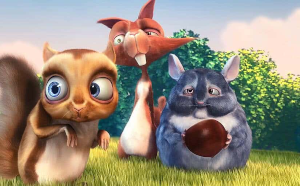
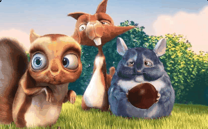

# Color Quantization and Dithering

Color quantization reduces an image to a small palette of colors, such as the 256 colors a GIF can
hold. Dithering hides the banding this causes by scattering the leftover error across neighboring
pixels, or by adding an ordered threshold pattern.

The library provides:

- [quantize](#quantize): the one-call way to reduce the colors of an image.
- [ditherImage](#ditherimage) and [ditherImageBayer](#ditherimagebayer): map an image to the palette
  of a quantizer you choose, with control over the dithering.
- [Quantizers](#quantizers): `NeuralQuantizer`, `OctreeQuantizer` and `BinaryQuantizer`, which build a
  palette and find the closest palette color for a pixel.

All of these return a **new palette image**: a one-channel image whose pixels are indices into a
[palette](image_data.md#palettes). The source image isn't modified. See also
[Image Processing](filters.md) for the other filters, and [GIF](formats.md#gif-decoding-encoding) for
how the GIF encoder uses quantization.

Quantization and dithering work with 8-bit color values and look at a single frame (the image you pass,
not its other animation frames). Convert images in other formats first, for example with
`image.convert(format: Format.uint8)`. RGB(A) uint8 images take a faster path when dithering.

## quantize

```dart
Image quantize(Image src, {
  int numberOfColors = 256,
  QuantizeMethod method = QuantizeMethod.neuralNet,
  DitherKernel dither = DitherKernel.none,
  bool ditherSerpentine = false, // deprecated, use ditherScanOrder
  DitherScanOrder? ditherScanOrder,
  double ditherStrength = 1.0,
})
```



| Parameter | Description |
| --- | --- |
| `numberOfColors` | The maximum size of the palette. Values below 4 always use the octree quantizer. |
| `method` | `QuantizeMethod.neuralNet` (NeuQuant, the default, best quality), `QuantizeMethod.octree` (fast) or `QuantizeMethod.binary` (black and white). |
| `dither` | The [dither kernel](#dither-kernels). The default, `DitherKernel.none`, maps each pixel to its closest palette color. |
| `ditherScanOrder` | The [scan order](#scan-orders) for error-diffusion kernels. Defaults to `DitherScanOrder.raster` (or `serpentine` if `ditherSerpentine` is true). |
| `ditherStrength` | Scales the pattern of the Bayer kernels; ignored by error-diffusion kernels. |

```dart
// Reduce to 16 colors with Floyd-Steinberg dithering.
final indexed = quantize(image,
    numberOfColors: 16,
    method: QuantizeMethod.octree,
    dither: DitherKernel.floydSteinberg);

// The result is a palette image; convert it back to RGB if needed.
final rgb = indexed.convert(numChannels: 3);
```

The [Command](commands.md) equivalent is `Command.quantize`, which doesn't have `ditherStrength`.

## ditherImage

```dart
Image ditherImage(Image image, {
  Quantizer? quantizer,
  DitherKernel kernel = DitherKernel.floydSteinberg,
  bool serpentine = false, // deprecated, use scanOrder
  DitherScanOrder scanOrder = DitherScanOrder.zigzag,
  double strength = 1.0,
})
```



Maps `image` to the palette of `quantizer`, diffusing the error with `kernel`. When `quantizer` is
null, a `NeuralQuantizer` with 256 colors is built from the image. Use your own quantizer to control
the number of colors, or to share one palette between several images.

| Parameter | Description |
| --- | --- |
| `quantizer` | Supplies the palette and the closest-color lookup. |
| `kernel` | The [dither kernel](#dither-kernels). `DitherKernel.none` maps each pixel to its closest color without dithering. The Bayer kernels are handled by [ditherImageBayer](#ditherimagebayer). |
| `scanOrder` | The [scan order](#scan-orders) for error-diffusion kernels. Defaults to `zigzag`. |
| `serpentine` | Deprecated. When true, it overrides `scanOrder` with `DitherScanOrder.serpentine`. |
| `strength` | Scales the pattern of the Bayer kernels; ignored by error-diffusion kernels. |

```dart
final quantizer = OctreeQuantizer(image, numberOfColors: 32);
final dithered = ditherImage(image,
    quantizer: quantizer,
    kernel: DitherKernel.atkinson,
    scanOrder: DitherScanOrder.serpentine);
```

Note that the default scan order is `zigzag` for the `ditherImage` function but `raster` for
`quantize`, `Command.ditherImage` and the GIF encoder. Pass a scan order explicitly if you need the
same result everywhere.

## ditherImageBayer

```dart
Image ditherImageBayer(Image image,
    [Quantizer? quantizer,
    DitherKernel kernel = DitherKernel.bayer4x4,
    double strength = 1.0])
```


Ordered dithering: before the palette lookup, each pixel is offset by a value from a fixed Bayer
threshold matrix that tiles the image. No error is propagated, so the result is deterministic, fast,
and has the regular crosshatch look of ordered dithering. `strength` scales the offset: 1.0 is the
classic full-range pattern, smaller values are subtler. `kernel` must be `bayer2x2`, `bayer4x4` or
`bayer8x8`. Note that the parameters are positional.

`ditherImage(image, kernel: DitherKernel.bayer8x8)` does the same thing, so you usually don't need to
call this function directly.

```dart
final bayer = ditherImageBayer(
    image, OctreeQuantizer(image, numberOfColors: 8), DitherKernel.bayer8x8, 0.5);
```

## Dither kernels

[DitherKernel](https://pub.dev/documentation/image/latest/image/DitherKernel.html) values:

| Kernel | Type | Notes |
| --- | --- | --- |
| `none` | | No dithering; closest palette color. |
| `floydSteinberg` | error diffusion | Classic 4-neighbor kernel (divisor 16). |
| `falseFloydSteinberg` | error diffusion | Simplified 3-neighbor kernel (divisor 8); cheaper, coarser. |
| `jarvisJudiceNinke` | error diffusion | 12 neighbors over 3 rows (divisor 48); smooth, slower. |
| `stucki` | error diffusion | 12 neighbors over 3 rows (divisor 42); sharper than Jarvis-Judice-Ninke. |
| `burkes` | error diffusion | Two-row variant of Stucki (divisor 32); faster. |
| `atkinson` | error diffusion | Spreads only 6/8 of the error, giving higher contrast and lighter shadows (the classic Macintosh look). |
| `bayer2x2`, `bayer4x4`, `bayer8x8` | ordered | Fixed threshold matrices; larger matrices give more distinct levels. |

## Scan orders

[DitherScanOrder](https://pub.dev/documentation/image/latest/image/DitherScanOrder.html) controls the
order in which the error-diffusion kernels visit the pixels. It has no effect on the Bayer kernels.

- `DitherScanOrder.raster`: every row left to right, top to bottom.
- `DitherScanOrder.serpentine`: alternate rows run right to left (boustrophedon order), which reduces
  directional artifacts.
- `DitherScanOrder.zigzag`: pixels are visited along the anti-diagonals `x + y == d`, alternating the
  direction of each diagonal (the JPEG-style ordering). It spreads the error along both axes, which
  softens the horizontal "worm" patterns of raster scanning.
- `DitherScanOrder.hilbert`: pixels follow a Hilbert space-filling curve, so consecutive pixels are
  always adjacent. This gives the strongest reduction of directional artifacts of the deterministic
  orders.

The older `serpentine` / `ditherSerpentine` booleans are deprecated in favor of the scan order
parameters. They are ignored when a scan order is given (for `quantize`, `Command.ditherImage` and the
GIF encoder) and override `scanOrder` when true (for the `ditherImage` function).

## Quantizers

A [Quantizer](https://pub.dev/documentation/image/latest/image/Quantizer-class.html) holds a palette
and finds the palette entry closest to a color:

| Member | Description |
| --- | --- |
| `Palette palette` | The quantized palette. |
| `int getColorIndex(Color c)` | The palette index for a color. |
| `int getColorIndexRgb(int r, int g, int b)` | The palette index for 8-bit RGB values. |
| `Color getQuantizedColor(Color c)` | The palette color for a color. |
| `Image getIndexImage(Image image)` | Maps every pixel of `image` to its closest palette index, without dithering, and returns the new palette image. |

### NeuralQuantizer

```dart
NeuralQuantizer(Image image, {int numberOfColors = 256, int samplingFactor = 10})
```

The NeuQuant neural-network algorithm by Anthony Dekker. It gives the best quality palettes and is the
default for `quantize`, `ditherImage` and the GIF encoder. `samplingFactor` trades quality for speed:
1 samples every pixel, and higher values sample fewer pixels (10 is a good balance; small images are
always fully sampled). At least 4 colors are used.

`addImage(Image image)` trains the network on another image, refining the palette, which is useful
for building one palette for several frames.

### OctreeQuantizer

```dart
OctreeQuantizer(Image image, {int numberOfColors = 256})
```

Builds an octree of the image colors and merges the least-used branches until at most
`numberOfColors` remain. Faster than the neural quantizer, and suited to small palettes.

### BinaryQuantizer

```dart
BinaryQuantizer({num threshold = 0.5})
```

A fixed two-color palette, black (index 0) and white (index 1). Colors whose normalized luminance is
below `threshold` map to black. It doesn't need to analyze an image.

### QuantizerType

[QuantizerType](https://pub.dev/documentation/image/latest/image/QuantizerType.html) (`octree`,
`neural`, `binary`) selects the quantizer used by
[GifEncoder](https://pub.dev/documentation/image/latest/image/GifEncoder-class.html):

```dart
final gif = GifEncoder(
        numColors: 64,
        quantizerType: QuantizerType.octree,
        dither: DitherKernel.floydSteinberg,
        ditherScanOrder: DitherScanOrder.serpentine)
    .encode(image);
```

### Using a quantizer directly

```dart
final quantizer = NeuralQuantizer(image, numberOfColors: 64);

// Palette image without dithering.
final indexed = quantizer.getIndexImage(image);

// The closest palette color to a color.
final c = quantizer.getQuantizedColor(ColorRgb8(200, 30, 90));

// One palette for two images.
final shared = NeuralQuantizer(frame1)..addImage(frame2);
final a = ditherImage(frame1, quantizer: shared);
final b = ditherImage(frame2, quantizer: shared);
```
