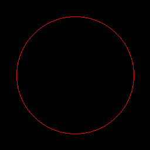
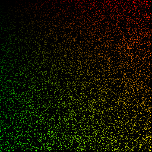
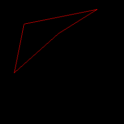
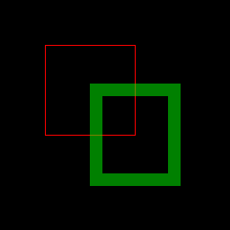
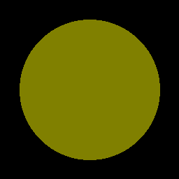
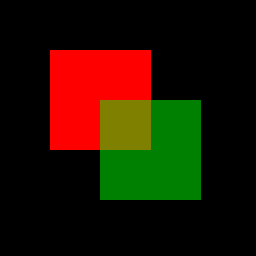

# Draw Functions

The Dart Image Library provides a number of functions for modifying images, by applying
color filters, transformations into other images (resize, crop), or basic drawing.

## Masking Draw Functions

Most of the drawing functions can take a mask parameter. A mask is an image that controls
the blending of the filter per pixel. You can specify which channel of the mask, or its luminance, to use for
the blending value. Where the mask channel is full intensity, the filter has full effect, and where
the mask channel is 0, it has no effect; and values in between will blend the filter with the original
image.

Using a mask image to blend the [sketch](https://pub.dev/documentation/image/latest/image/sketch.html) filter:


## Draw Functions

### [compositeImage](https://pub.dev/documentation/image/latest/image/compositeImage.html)

```dart  
Image compositeImage(Image dst, Image src, {
    int? dstX, int? dstY, int? dstW, int? dstH, int? srcX, int? srcY,
    int? srcW, int? srcH, BlendMode blend = BlendMode.alpha,
    bool linearBlend = false,
    bool center = false, Image? mask,
    Channel maskChannel = Channel.luminance })
```


### [drawChar](https://pub.dev/documentation/image/latest/image/drawChar.html)

```dart
Image drawChar(Image image, String char, { required BitmapFont font,
    required int x, required int y, Color? color, Image? mask,
    Channel maskChannel = Channel.luminance });
```


### [drawCircle](https://pub.dev/documentation/image/latest/image/drawCircle.html)

```dart
Image drawCircle(Image image, { required int x, required int y,
    required int radius, required Color color, bool antialias = false,
    Image? mask, Channel maskChannel = Channel.luminance })
```



### [drawLine](https://pub.dev/documentation/image/latest/image/drawLine.html)

```dart
Image drawLine(Image image, { required int x1, required int y1,
    required int x2, required int y2, required Color color,
    bool antialias = false, num thickness = 1, Image? mask,
    Channel maskChannel = Channel.luminance })
```


### [drawPixel](https://pub.dev/documentation/image/latest/image/drawPixel.html)

```dart
Image drawPixel(Image image, int x, int y, Color c, { Color? filter,
    num? alpha, BlendMode blend = BlendMode.alpha,
    bool linearBlend = false, Image? mask,
    Channel maskChannel = Channel.luminance })
```



### [drawPolygon](https://pub.dev/documentation/image/latest/image/drawPolygon.html)

```dart
Image drawPolygon(Image src, { required List<Point> vertices,
    required Color color, bool antialias = false, Image? mask, Channel maskChannel = Channel.luminance })
```



### [drawRect](https://pub.dev/documentation/image/latest/image/drawRect.html)

```dart
Image drawRect(Image dst, { required int x1, required int y1, required int x2,
    required int y2, required Color color, num radius = 0, num thickness = 1, Image? mask,
    Channel maskChannel = Channel.luminance })
```



### [drawString](https://pub.dev/documentation/image/latest/image/drawString.html)

```dart
Image drawString(Image image, String string, { required BitmapFont font,
    int? x, int? y, Color? color, bool rightJustify = false, bool wrap = false,
    Image? mask, Channel maskChannel = Channel.luminance })
```


### [fill](https://pub.dev/documentation/image/latest/image/fill.html)

```dart
Image fill(Image image, { required Color color, Image? mask,
Channel maskChannel = Channel.luminance })
```


### [fillCircle](https://pub.dev/documentation/image/latest/image/fillCircle.html)

```dart
Image fillCircle(Image image, { required int x, required int y,
  required int radius, required Color color, bool antialias = false, 
  Image? mask, Channel maskChannel = Channel.luminance})
```



### [fillFlood](https://pub.dev/documentation/image/latest/image/fillFlood.html)

```dart
Image fillFlood(Image src, { required int x, required int y,
    required Color color, num threshold = 0.0, bool compareAlpha = false,
    Image? mask, Channel maskChannel = Channel.luminance })
```


### [fillPolygon](https://pub.dev/documentation/image/latest/image/fillPolygon.html)

```dart
Image fillPolygon(Image src, { required List<Point> vertices,
    required Color color, Image? mask, Channel maskChannel = Channel.luminance })
```


### [fillRect](https://pub.dev/documentation/image/latest/image/fillRect.html)

```dart
Image fillRect(Image src, { required int x1, required int y1, required int x2,
    required int y2, required Color color, num Radius = 0, Image? mask,
    Channel maskChannel = Channel.luminance })
```


