# Drawing

The drawing functions render pixels, lines, shapes and text into an image, fill areas, and
composite one image onto another.

```dart
import 'package:image/image.dart' as img;

Future<void> main() async {
  final image = img.Image(width: 256, height: 256, numChannels: 4);
  img.fill(image, color: img.ColorRgba8(255, 255, 255, 255));
  img.fillRect(image,
      x1: 16, y1: 16, x2: 240, y2: 120, radius: 12,
      color: img.ColorRgb8(30, 90, 200));
  img.drawLine(image,
      x1: 16, y1: 200, x2: 240, y2: 140,
      color: img.ColorRgba8(200, 30, 30, 255), thickness: 3, antialias: true);
  img.fillCircle(image,
      x: 128, y: 200, radius: 40, color: img.ColorRgba8(0, 160, 0, 160),
      antialias: true);
  img.drawString(image, 'Hello', font: img.arial24, x: 24, y: 24,
      color: img.ColorRgb8(255, 255, 255));
  await img.encodePngFile('drawing.png', image);
}
```

## Basics

* **In place.** Every drawing function modifies the image you pass in and returns that same
  image, so calls can be chained or nested. The one exception is
  [compositeImage](#compositeimage) on a palette image, described below.
* **Coordinates** are in pixels, with (0, 0) at the top-left corner. Anything drawn outside the
  image is clipped, so it's safe to draw shapes that are partly off the image.
* **Colors** can be any [Color](https://pub.dev/documentation/image/latest/image/Color-class.html),
  such as `ColorRgb8(r, g, b)` or `ColorRgba8(r, g, b, a)`. A color's alpha controls how much it
  covers what's underneath. For images that aren't 8-bit, use a color of the image's own format
  (for example `ColorUint16.rgba(r, g, b, a)` for a 16-bit image). See
  [Image Data](image_data.md) for the color classes.
* **Palette images** are drawn to without blending; the color is written as-is. Convert them
  first (`image.convert(numChannels: 4)`) if you need alpha blending or antialiasing.
* **Commands.** The drawing functions are also available as methods of the [Command API](commands.md).

## Common parameters

Most drawing functions share these named parameters:

| Parameter | Default | Description |
|---|---|---|
| `color` | | The color to draw with. Its alpha sets the opacity. |
| `blend` | `BlendMode.alpha` | How the color is combined with the existing pixels. See [Blend modes](#blend-modes). |
| `antialias` | `false` | Smooth edges by partly covering edge pixels. Lines, circles and polygon outlines. |
| `mask` | `null` | An image that controls, per pixel, how much of the drawing is applied. See [Masks](#masks). |
| `maskChannel` | `Channel.luminance` | Which channel of `mask` to use: `red`, `green`, `blue`, `alpha` or `luminance`. |

`drawPixel` and `compositeImage` also take `linearBlend`. When it's `true`, colors are mixed in
linear space (removing a 2.2 gamma first and reapplying it afterwards), which gives more
physically accurate blends of bright and dark colors, at some cost in speed.

### Blend modes

`BlendMode` chooses how a drawn color (the overlay) is combined with the pixel already in the
image (the base). Except for `direct`, the blended color is then mixed onto the base using the
overlay's alpha, the `mask`, and any `alpha` argument.

| BlendMode | Result |
|---|---|
| `direct` | Writes the color as-is, replacing the pixel, including its alpha. No blending; in `drawPixel` and the shape functions the color's alpha, the `alpha` argument and the `mask` aren't applied. |
| `alpha` | Standard "over" alpha blending. The default. |
| `lighten` | The lighter of base and overlay, per channel. |
| `darken` | The darker of base and overlay, per channel. |
| `screen` | Brightens: `1 - (1 - base) * (1 - overlay)`. |
| `multiply` | Darkens: `base * overlay`. |
| `addition` | `base + overlay`. |
| `subtract` | `base - overlay`. |
| `difference` | `abs(overlay - base)`. |
| `divide` | `base / overlay`. |
| `dodge` | Color dodge: brightens the base to reflect the overlay. |
| `burn` | Color burn: darkens the base to reflect the overlay. |
| `overlay` | Multiply or screen, depending on the base. |
| `softLight` | A softer version of `overlay`. |
| `hardLight` | Multiply or screen, depending on the overlay. |

Results are clamped to the range of the image's format.

### Masks

A mask is an image whose pixels control how much of the drawing is applied at each position.
Where the chosen `maskChannel` is at full intensity the drawing has full effect, where it's 0 it
has no effect, and values in between blend the drawing with the original image. Masks are
sampled at the same coordinates as the pixel being drawn, so a mask is usually the same size as
the image.

The same `mask` and `maskChannel` parameters are used by the [filter functions](filters.md).
Here's a mask used to blend the [sketch](https://pub.dev/documentation/image/latest/image/sketch.html)
filter:


```dart
// A radial gradient mask: draw red that fades out towards the edges.
final mask = img.Image(width: image.width, height: image.height);
for (final p in mask) {
  final dx = p.x - mask.width / 2;
  final dy = p.y - mask.height / 2;
  final d = (dx * dx + dy * dy) / (mask.width * mask.width / 4);
  final v = (255 * (1 - d)).clamp(0, 255);
  p.setRgb(v, v, v);
}
img.fill(image, color: img.ColorRgb8(255, 0, 0), mask: mask);
```

## Pixels

### [drawPixel](https://pub.dev/documentation/image/latest/image/drawPixel.html)

```dart
Image drawPixel(Image image, int x, int y, Color c, {Color? filter, num? alpha,
    BlendMode blend = BlendMode.alpha, bool linearBlend = false, Image? mask,
    Channel maskChannel = Channel.luminance})
```

Blends the color `c` into the pixel at (`x`, `y`). This is the building block of the other
drawing functions.

* `filter` multiplies `c`, channel by channel (including alpha), by another color. This is how
  text is tinted.
* `alpha` (0 to 1) replaces the alpha of `c`.

To set a pixel without any blending, use `image.setPixel(x, y, color)` or
`image.setPixelRgba(x, y, r, g, b, a)` instead.

```dart
img.drawPixel(image, 10, 10, img.ColorRgba8(255, 0, 0, 128)); // 50% red
img.drawPixel(image, 11, 10, img.ColorRgb8(255, 0, 0), alpha: 0.25);
```

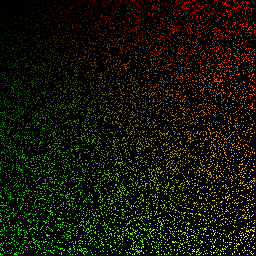

## Lines

### [drawLine](https://pub.dev/documentation/image/latest/image/drawLine.html)

```dart
Image drawLine(Image image, {required int x1, required int y1, required int x2,
    required int y2, required Color color, bool antialias = false,
    num thickness = 1, BlendMode blend = BlendMode.alpha, Image? mask,
    Channel maskChannel = Channel.luminance})
```

Draws a line from (`x1`, `y1`) to (`x2`, `y2`), including both end points. `thickness` is the
width of the line in pixels, and `antialias` smooths its edges. The line is clipped to the
image first, so end points can be outside it.

```dart
img.drawLine(image, x1: 0, y1: 0, x2: 99, y2: 49,
    color: img.ColorRgb8(0, 0, 0), thickness: 2, antialias: true);
```

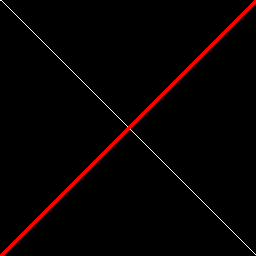

## Rectangles

### [drawRect](https://pub.dev/documentation/image/latest/image/drawRect.html)

```dart
Image drawRect(Image dst, {required int x1, required int y1, required int x2,
    required int y2, required Color color, num thickness = 1, num radius = 0,
    BlendMode blend = BlendMode.alpha, Image? mask,
    Channel maskChannel = Channel.luminance})
```

Draws the outline of the rectangle with corners (`x1`, `y1`) and (`x2`, `y2`). The corners can
be given in either order. `thickness` is the width of the outline. `radius` rounds the corners
(with antialiased arcs); a rounded rectangle is drawn with a 1 pixel outline.

```dart
img.drawRect(image, x1: 10, y1: 10, x2: 89, y2: 59,
    color: img.ColorRgb8(255, 0, 0), thickness: 3);
```

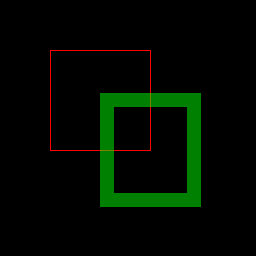

### [fillRect](https://pub.dev/documentation/image/latest/image/fillRect.html)

```dart
Image fillRect(Image src, {required int x1, required int y1, required int x2,
    required int y2, required Color color, num radius = 0, bool alphaBlend = true,
    Image? mask, Channel maskChannel = Channel.luminance})
```

Fills the rectangle with corners (`x1`, `y1`) and (`x2`, `y2`), both included, so
`x1: 0, x2: 9` fills 10 columns. `radius` rounds the corners, with antialiased edges.

`fillRect` has no `blend` parameter. Instead, `alphaBlend: false` writes `color` directly,
replacing the pixels (including their alpha) instead of blending over them; it applies to
square corners.

```dart
img.fillRect(image, x1: 20, y1: 20, x2: 79, y2: 49,
    color: img.ColorRgb8(255, 200, 0), radius: 8);
// Clear a region to fully transparent.
img.fillRect(image, x1: 0, y1: 0, x2: 31, y2: 31,
    color: img.ColorRgba8(0, 0, 0, 0), alphaBlend: false);
```

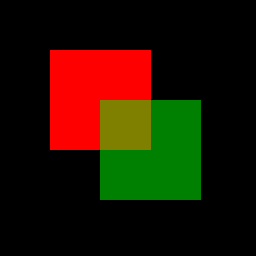

## Circles

### [drawCircle](https://pub.dev/documentation/image/latest/image/drawCircle.html)

```dart
Image drawCircle(Image image, {required int x, required int y,
    required int radius, required Color color, bool antialias = false,
    BlendMode blend = BlendMode.alpha, Image? mask,
    Channel maskChannel = Channel.luminance})
```

Draws a 1 pixel wide circle outline centered at (`x`, `y`). `antialias` smooths the outline.

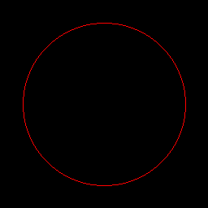

### [fillCircle](https://pub.dev/documentation/image/latest/image/fillCircle.html)

```dart
Image fillCircle(Image image, {required int x, required int y,
    required int radius, required Color color, bool antialias = false,
    BlendMode blend = BlendMode.alpha, Image? mask,
    Channel maskChannel = Channel.luminance})
```

Fills a circle centered at (`x`, `y`). `antialias` smooths the edge.

```dart
img.drawCircle(image, x: 50, y: 50, radius: 40,
    color: img.ColorRgb8(0, 0, 0), antialias: true);
img.fillCircle(image, x: 50, y: 50, radius: 30,
    color: img.ColorRgba8(0, 128, 255, 200), antialias: true);
```

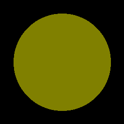

## Polygons

Polygons are lists of [Point](#point) vertices. The shape is closed automatically: the last
vertex is joined to the first.

### [drawPolygon](https://pub.dev/documentation/image/latest/image/drawPolygon.html)

```dart
Image drawPolygon(Image src, {required List<Point> vertices,
    required Color color, bool antialias = false, num thickness = 1,
    BlendMode blend = BlendMode.alpha, Image? mask,
    Channel maskChannel = Channel.luminance})
```

Draws the outline of the polygon, using [drawLine](#drawline) for each edge, with the given
`thickness` and `antialias`. One vertex draws a pixel and two draw a line.

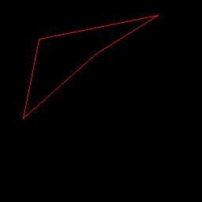

### [fillPolygon](https://pub.dev/documentation/image/latest/image/fillPolygon.html)

```dart
Image fillPolygon(Image src, {required List<Point> vertices,
    BlendMode blend = BlendMode.alpha, required Color color, Image? mask,
    Channel maskChannel = Channel.luminance})
```

Fills the polygon. Pixels whose centers are inside the shape are filled, using the even-odd
rule, so overlapping parts of a self-intersecting polygon (such as the middle of a five-pointed
star drawn with crossing edges) are left empty. Filled edges aren't antialiased; draw an
antialiased outline over them with `drawPolygon` if you need smooth edges.

```dart
final triangle = [img.Point(50, 10), img.Point(90, 90), img.Point(10, 90)];
img.fillPolygon(image, vertices: triangle, color: img.ColorRgb8(255, 128, 0));
img.drawPolygon(image, vertices: triangle, color: img.ColorRgb8(0, 0, 0),
    antialias: true);
```

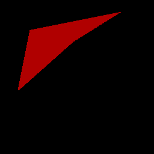

## Filling

### [fill](https://pub.dev/documentation/image/latest/image/fill.html)

```dart
Image fill(Image image, {required Color color, Image? mask,
    Channel maskChannel = Channel.luminance})
```

Sets every pixel of the image to `color`, replacing (not blending with) what's there. With a
`mask`, each pixel is mixed between its old value and `color` by the mask value.

```dart
img.fill(image, color: img.ColorRgba8(0, 0, 0, 0)); // clear to transparent
```

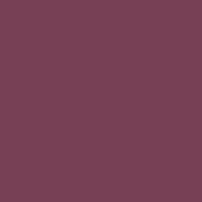

### [fillFlood](https://pub.dev/documentation/image/latest/image/fillFlood.html)

```dart
Image fillFlood(Image src, {required int x, required int y,
    required Color color, num threshold = 0.0, bool compareAlpha = false,
    Image? mask, Channel maskChannel = Channel.luminance})
```

The "paint bucket": fills the area connected to (`x`, `y`) whose pixels have the same color as
that starting pixel. Pixels connect horizontally and vertically, not diagonally. Filled pixels
are replaced with `color`, not blended.

* `threshold` also fills pixels whose color is within that distance of the starting color,
  measured in the CIE L\*a\*b\* color space (where a distance of about 2 is barely noticeable and
  100 is the difference between black and white). Use it for photos and antialiased edges.
* `compareAlpha` includes alpha when comparing colors.
* With a `mask`, filled pixels are mixed with `color` by the mask value.

```dart
img.fillFlood(image, x: 20, y: 20, color: img.ColorRgb8(0, 200, 0),
    threshold: 10);
```

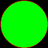

### [maskFlood](https://pub.dev/documentation/image/latest/image/maskFlood.html)

```dart
Uint8List maskFlood(Image src, int x, int y, {num threshold = 0.0,
    bool compareAlpha = false, int fillValue = 255})
```

Finds the same connected area as `fillFlood` without changing the image. It returns one byte
per pixel (`width * height` bytes, row by row), set to `fillValue` inside the area and 0
elsewhere. You can use it to select a region, or to build a mask image:

```dart
final selection = img.maskFlood(image, 20, 20, threshold: 10);
final maskImage = img.Image.fromBytes(
    width: image.width, height: image.height,
    bytes: selection.buffer, numChannels: 1);
img.fill(image, color: img.ColorRgb8(255, 0, 0), mask: maskImage);
```

## Text

### [drawString](https://pub.dev/documentation/image/latest/image/drawString.html)

```dart
Image drawString(Image image, String string, {required BitmapFont font,
    int? x, int? y, Color? color, bool rightJustify = false, bool wrap = false,
    BlendMode blend = BlendMode.alpha, Image? mask,
    Channel maskChannel = Channel.luminance})
```

Draws text with a bitmap font. Leave out `x` or `y` to center the text horizontally or
vertically. `color` tints the font, `\n` starts a new line, `rightJustify` makes `x` the right
edge of the text, and `wrap` breaks lines at the right edge of the image.

```dart
img.drawString(image, 'Hello World', font: img.arial24, x: 10, y: 10,
    color: img.ColorRgb8(255, 0, 0));
img.drawString(image, 'Centered', font: img.arial48); // centered in the image
```

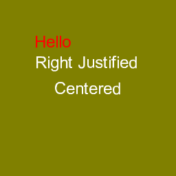

### [drawChar](https://pub.dev/documentation/image/latest/image/drawChar.html)

```dart
Image drawChar(Image image, String char, {required BitmapFont font,
    required int x, required int y, Color? color,
    BlendMode blend = BlendMode.alpha, Image? mask,
    Channel maskChannel = Channel.luminance})
```

Draws the first character of `char` with its top-left corner at (`x`, `y`).

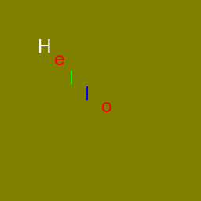

See [Font Rendering](fonts.md) for the details of both functions, the built-in fonts, and how to
load your own.

## Compositing

### [compositeImage](https://pub.dev/documentation/image/latest/image/compositeImage.html)

```dart
Image compositeImage(Image dst, Image src, {int? dstX, int? dstY, int? dstW,
    int? dstH, int? srcX, int? srcY, int? srcW, int? srcH,
    BlendMode blend = BlendMode.alpha, bool linearBlend = false,
    bool center = false, Image? mask, Channel maskChannel = Channel.luminance})
```

Draws `src` (or a rectangle of it) onto `dst`, for watermarks, overlays, collages and copying
regions between images. It takes the `srcW` x `srcH` rectangle of `src` at (`srcX`, `srcY`) and
draws it into the `dstW` x `dstH` rectangle of `dst` at (`dstX`, `dstY`), stretching or
shrinking it if the sizes differ (with nearest-neighbor sampling).

| Parameter | Default |
|---|---|
| `srcX`, `srcY` | 0 |
| `srcW`, `srcH` | The width and height of `src` |
| `dstX`, `dstY` | 0 |
| `dstW`, `dstH` | The size of `src`, limited to the size of `dst` |
| `center` | `false`. When `true`, `dstX` and `dstY` are replaced with the position that centers `src` in `dst`. |
| `blend` | `BlendMode.alpha`, so transparent parts of `src` show `dst` through. `BlendMode.direct` copies the pixels, alpha included. |

Because of these defaults, a `src` larger than `dst` is scaled down to fit `dst` when you don't
give any sizes. Pass the sizes explicitly to control scaling: equal source and destination
sizes give a 1:1 copy, and the part outside `dst` is clipped.

```dart
// Paste a logo at 1:1 in the bottom-right corner.
img.compositeImage(photo, logo,
    dstX: photo.width - logo.width - 16,
    dstY: photo.height - logo.height - 16,
    dstW: logo.width,
    dstH: logo.height);

// Draw a 64x64 sprite from a sprite sheet at double size.
img.compositeImage(canvas, sheet,
    srcX: 128, srcY: 0, srcW: 64, srcH: 64,
    dstX: 10, dstY: 10, dstW: 128, dstH: 128);

// Copy pixels exactly, replacing what's in dst.
img.compositeImage(canvas, tile,
    dstX: 0, dstY: 0, dstW: tile.width, dstH: tile.height,
    blend: img.BlendMode.direct);
```

Notes:

* With `BlendMode.direct`, no `mask`, the same format and number of channels in both images,
  and a non-negative `dstX` and `dstY`, the pixels are copied as bytes, which is very fast.
* `mask` is sampled at destination coordinates for blended modes, and at source coordinates
  for `BlendMode.direct`.
* If `dst` has a palette and `blend` isn't `direct`, `dst` is converted to a non-palette copy,
  which is drawn into and returned; the image you passed isn't changed. Use the return value.
* `dst` and `src` can be the same image, but overlapping regions give unpredictable results.

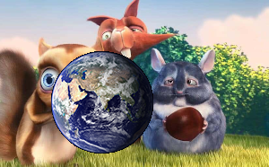

## Helper types

### Point

[Point](https://pub.dev/documentation/image/latest/image/Point-class.html) is a 2D point with
`num` coordinates, used for polygon vertices and by `copyRectify`.

```dart
final p = img.Point(10, 20.5);
final q = p + img.Point(5, 5); // (15, 25.5)
final r = q * 2.0;             // (30, 51)
print('${r.xi}, ${r.yi}');     // integer coordinates: 30, 51
```

`Point()` is (0, 0), and `Point.from(other)` copies a point. Points can be compared with `==`.

### clipLine

[clipLine](https://pub.dev/documentation/image/latest/image/clipLine.html) clips a line,
`[x1, y1, x2, y2]`, to a rectangle, `[left, top, right, bottom]`, in place. It returns `false`
if the line is entirely outside. `drawLine` uses it, and it's useful for your own line drawing.

```dart
final line = [-50, 10, 300, 80];
if (img.clipLine(line, [0, 0, image.width - 1, image.height - 1])) {
  // line now holds the visible part.
}
```

## See also

* [Font Rendering](fonts.md): bitmap fonts and text.
* [Image Processing](filters.md): color filters and effects, which also take masks.
* [Transform Functions](transform.md): resize, crop, rotate and more.
* [API reference](https://pub.dev/documentation/image/latest/image/)
