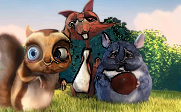
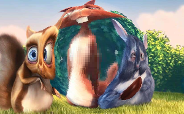
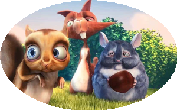
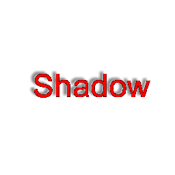
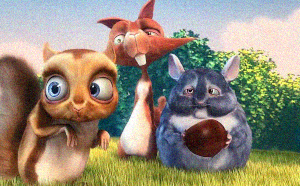
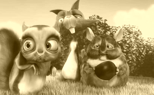
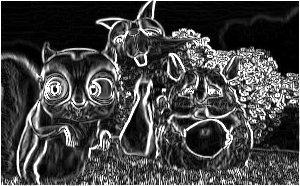
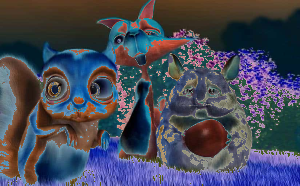
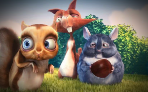

# Image Processing

The Dart Image Library provides a number of functions for applying color filters to images. These
functions will be applied to the image itself rather than create a new image.

## Masking Filter Functions

Most of the drawing and filter functions can take a mask parameter. A mask is an image that controls
the blending of the filter per pixel. You can specify which channel of the mask, or its luminance, to use for
the blending value. Where the mask channel is full intensity, the filter has full effect, and where
the mask channel is 0, it has no effect; and values in between will blend the filter with the original
image.

Using a mask image to blend the [sketch](https://pub.dev/documentation/image/latest/image/sketch.html) filter:

 


## Filter Functions

### [adjustColor](https://pub.dev/documentation/image/latest/image/adjustColor.html)

```dart
Image adjustColor(Image src,
{ Color? blacks, Color? whites, Color? mids, num? contrast, num? saturation, num? brightness, num? gamma, num? exposure,
num? hue, num amount = 1, Image? mask, Channel maskChannel = Channel.luminance })
```


### [billboard](https://pub.dev/documentation/image/latest/image/billboard.html)

```dart
Image billboard(Image src, { num grid = 10, num amount = 1, Image? mask, Channel maskChannel = Channel.luminance })
```


### [bleachBypass](https://pub.dev/documentation/image/latest/image/bleachBypass.html)

```dart
Image bleachBypass(Image src, { num amount = 1, Image? mask, Channel maskChannel = Channel.luminance })
```


### [bulgeDistortion](https://pub.dev/documentation/image/latest/image/bulgeDistortion.html)

```dart
Image bulgeDistortion(Image src, { int? centerX, int? centerY, num? radius, num scale = 0.5,
    Interpolation interpolation = Interpolation.nearest, Image? mask, Channel maskChannel = Channel.luminance })
```


  
### [bumpToNormal](https://pub.dev/documentation/image/latest/image/bumpToNormal.html)

```dart
Image bumpToNormal(Image src, { num strength = 2 })
```


### [chromaticAberration](https://pub.dev/documentation/image/latest/image/chromaticAberration.html)

```dart
Image chromaticAberration(Image src, { int shift = 5, Image? mask, Channel maskChannel = Channel.luminance })
```


### [colorHalftone](https://pub.dev/documentation/image/latest/image/colorHalftone.html)

```dart
Image colorHalftone(Image src, { num amount = 1, int? centerX, int? centerY,
    num angle = 180, num size = 5, Image? mask, Channel maskChannel = Channel.luminance })
```


### [colorOffset](https://pub.dev/documentation/image/latest/image/colorOffset.html)

```dart
Image colorOffset(Image src, { num red = 0, num green = 0, num blue = 0, num alpha = 0,
    Image? mask, Channel maskChannel = Channel.luminance })
```


### [contrast](https://pub.dev/documentation/image/latest/image/contrast.html)

```dart
Image contrast(Image src, { required num contrast, Image? mask, Channel maskChannel = Channel.luminance,
    ContrastMode mode = ContrastMode.proportional})
```


### [convolution](https://pub.dev/documentation/image/latest/image/convolution.html)

```dart
Image convolution(Image src, { required List<num> filter,
    num div = 1.0, num offset = 0.0, num amount = 1, Image? mask, Channel maskChannel = Channel.luminance })
```


### [copyImageChannels](https://pub.dev/documentation/image/latest/image/copyImageChannels.html)

```dart
Image copyImageChannels(Image src, { required Image from, bool scaled = false,
    Channel? red, Channel? green, Channel? blue, Channel? alpha,
    Image? mask, Channel maskChannel = Channel.luminance })
```



### [ditherImage](https://pub.dev/documentation/image/latest/image/ditherImage.html)

```dart
Image ditherImage(Image image, { Quantizer? quantizer,
  DitherKernel kernel = DitherKernel.floydSteinberg,
  bool serpentine = false })
```


### [dotScreen](https://pub.dev/documentation/image/latest/image/dotScreen.html)

```dart
Image dotScreen(Image src, { num angle = 180, num size = 5.75, int? centerX,
    int? centerY, num amount = 1, Image? mask,
    Channel maskChannel = Channel.luminance })
```


### [dropShadow](https://pub.dev/documentation/image/latest/image/dropShadow.html)

```dart
Image dropShadow(Image src, int hShadow, int vShadow, int blur, { Color? shadowColor })
```



### [edgeGlow](https://pub.dev/documentation/image/latest/image/edgeGlow.html)

```dart
Image edgeGlow(Image src, { num amount = 1, Image? mask, Channel maskChannel = Channel.luminance })
```


### [emboss](https://pub.dev/documentation/image/latest/image/emboss.html)

```dart
Image emboss(Image src, { num amount = 1, Image? mask, Channel maskChannel = Channel.luminance })
```


### [gamma](https://pub.dev/documentation/image/latest/image/gamma.html)

```dart
Image gamma(Image src, { required num gamma, Image? mask, Channel maskChannel = Channel.luminance })
```


### [gaussianBlur](https://pub.dev/documentation/image/latest/image/gaussianBlur.html)

```dart
Image gaussianBlur(Image src, { required int radius, Image? mask, Channel maskChannel = Channel.luminance })
```


### [grayscale](https://pub.dev/documentation/image/latest/image/grayscale.html)

```dart
Image grayscale(Image src, { num amount = 1, Image? mask, Channel maskChannel = Channel.luminance })
```


### [hdrToLdr](https://pub.dev/documentation/image/latest/image/hdrToLdr.html)

```dart
Image hdrToLdr(Image hdr, { num? exposure })
```


### [hexagonPixelate](https://pub.dev/documentation/image/latest/image/hexagonPixelate.html)

```dart
Image hexagonPixelate(Image src, { int? centerX, int? centerY, int size = 5,
    num amount = 1, Image? mask, Channel maskChannel = Channel.luminance })
```


### [invert](https://pub.dev/documentation/image/latest/image/invert.html)

```dart
Image invert(Image src, { Image? mask, Channel maskChannel = Channel.luminance })
```


### [luminanceThreshold](https://pub.dev/documentation/image/latest/image/luminanceThreshold.html)

```dart
Image luminanceThreshold(Image src, { num threshold = 0.5,
    bool outputColor = false, num amount = 1, Image? mask, Channel maskChannel = Channel.luminance })
```


### [monochrome](https://pub.dev/documentation/image/latest/image/monochrome.html)

```dart
Image monochrome(Image src, { Color? color, num amount = 1,
    Image? mask, Channel maskChannel = Channel.luminance })
```


### [noise](https://pub.dev/documentation/image/latest/image/noise.html)

```dart
Image noise(Image image, num sigma, { NoiseType type = NoiseType.gaussian, Random? random,
    Image? mask, Channel maskChannel = Channel.luminance })
```



### [normalize](https://pub.dev/documentation/image/latest/image/normalize.html)

```dart
Image normalize(Image src, { required num min, required num max,
    Image? mask, Channel maskChannel = Channel.luminance })
```


### [pixelate](https://pub.dev/documentation/image/latest/image/pixelate.html)

```dart
Image pixelate(Image src, { required int size,
    PixelateMode mode = PixelateMode.upperLeft, num amount = 1, Image? mask,
    Channel maskChannel = Channel.luminance })
```


### [quantize](https://pub.dev/documentation/image/latest/image/quantize.html)

```dart
Image quantize(Image src, { int numberOfColors = 256, QuantizeMethod method = QuantizeMethod.neuralNet,
  DitherKernel dither = DitherKernel.none, bool ditherSerpentine = false })
```


### [reinhardTonemap](https://pub.dev/documentation/image/latest/image/reinhardTonemap.html)

```dart
Image reinhardTonemap(Image hdr, { Image? mask, Channel maskChannel = Channel.luminance })
```


### [remapColors](https://pub.dev/documentation/image/latest/image/remapColors.html)

```dart
Image remapColors(Image src, { Channel red = Channel.red, Channel green = Channel.green,
  Channel blue = Channel.blue, Channel alpha = Channel.alpha })
```


### [scaleRgba](https://pub.dev/documentation/image/latest/image/scaleRgba.html)

```dart
Image scaleRgba(Image src, { required Color scale, Image? mask, Channel maskChannel = Channel.luminance })
```


### [separableConvolution](https://pub.dev/documentation/image/latest/image/separableConvolution.html)

```dart
Image separableConvolution(Image src, { required SeparableKernel kernel,
    Image? mask, Channel maskChannel = Channel.luminance })
```


### [sepia](https://pub.dev/documentation/image/latest/image/sepia.html)

```dart
Image sepia(Image src, { num amount = 1, Image? mask, Channel maskChannel = Channel.luminance })
```



### [sketch](https://pub.dev/documentation/image/latest/image/sketch.html)

```dart
Image sketch(Image src, { num amount = 1, Image? mask, Channel maskChannel = Channel.luminance })
```


### [smooth](https://pub.dev/documentation/image/latest/image/smooth.html)

```dart
Image smooth(Image src, { required num weight, Image? mask, Channel maskChannel = Channel.luminance })
```


### [sobel](https://pub.dev/documentation/image/latest/image/sobel.html)

```dart
Image sobel(Image src, { num amount = 1, Image? mask, Channel maskChannel = Channel.luminance })
```



### [solarize](https://pub.dev/documentation/image/latest/image/solarize.html)

```dart
enum SolarizeMode { highlights, shadows }
Image solarize(Image src, { required int threshold, SolarizeMode mode = SolarizeMode.highlights })
```



### [stretchDistortion](https://pub.dev/documentation/image/latest/image/stretchDistortion.html)

```dart
Image stretchDistortion(Image src, { int? centerX, int? centerY,
    Interpolation interpolation = Interpolation.nearest, Image? mask, Channel maskChannel = Channel.luminance })
```


### [vignette](https://pub.dev/documentation/image/latest/image/vignette.html)

```dart
Image vignette(Image src, { num start = 0.3, num end = 0.85,
    num amount = 0.9, Color? color, Image? mask, Channel maskChannel = Channel.luminance })
```


