# Image Processing

The library has a large set of filter functions for adjusting colors, blurring, detecting edges,
stylizing, distorting and tone mapping images.

```dart
import 'package:image/image.dart' as img;

void main() async {
  final image = await img.decodeImageFile('photo.jpg');
  if (image == null) return;
  img.sepia(image, amount: 0.8);
  img.vignette(image);
  await img.encodeJpgFile('photo_sepia.jpg', image);
}
```

## Contents

- [How filters work](#how-filters-work): in-place modification, masks, `amount`, formats and speed
- [Color adjustment](#color-adjustment): [adjustColor](#adjustcolor), [colorOffset](#coloroffset),
  [contrast](#contrast), [gamma](#gamma), [grayscale](#grayscale), [invert](#invert),
  [monochrome](#monochrome), [scaleRgba](#scalergba), [sepia](#sepia), [bleachBypass](#bleachbypass),
  [solarize](#solarize), [luminanceThreshold](#luminancethreshold), [normalize](#normalize),
  [histogramEqualization](#histogramequalization), [histogramStretch](#histogramstretch)
- [Channels](#channels): [remapColors](#remapcolors), [copyImageChannels](#copyimagechannels)
- [Blur, sharpen and convolution](#blur-sharpen-and-convolution): [gaussianBlur](#gaussianblur),
  [smooth](#smooth), [convolution](#convolution), [separableConvolution](#separableconvolution)
- [Edges and stylize](#edges-and-stylize): [sobel](#sobel), [edgeGlow](#edgeglow), [sketch](#sketch),
  [emboss](#emboss), [billboard](#billboard), [colorHalftone](#colorhalftone), [dotScreen](#dotscreen),
  [pixelate](#pixelate), [hexagonPixelate](#hexagonpixelate),
  [chromaticAberration](#chromaticaberration), [vignette](#vignette), [dropShadow](#dropshadow)
- [Distortion](#distortion): [bulgeDistortion](#bulgedistortion),
  [stretchDistortion](#stretchdistortion)
- [Noise](#noise)
- [HDR and tone mapping](#hdr-and-tone-mapping): [hdrToLdr](#hdrtoldr),
  [reinhardTonemap](#reinhardtonemap)
- [Normal maps](#normal-maps): [bumpToNormal](#bumptonormal)
- [Color reduction and dithering](#color-reduction-and-dithering): [quantize](#quantize),
  [ditherImage](#ditherimage)
- [Color helper functions](#color-helper-functions)
- [Writing your own filter](#writing-your-own-filter)

Resizing, cropping, rotating and flipping are covered in [Transform Functions](transform.md), and
drawing and compositing in [Drawing Functions](draw.md).

## How filters work

### Filters modify the image in place

Filter functions modify the image you pass in and return it, so calls can be nested or chained:

```dart
img.gaussianBlur(img.grayscale(image), radius: 2);
```

To keep the original, filter a copy: `img.sepia(image.clone())`.

Always use the returned image. A few filters can return a different object:

- Palette images are converted to RGB(A) before filtering (filters work on colors, not palette
  indices), and the converted image is returned. `histogramEqualization` and `histogramStretch` also
  convert float and one- or two-channel images.
- [bumpToNormal](#bumptonormal), [hdrToLdr](#hdrtoldr) and [dropShadow](#dropshadow) always return a
  new image and leave the source unchanged.
- [quantize](#quantize) and [ditherImage](#ditherimage) return a new palette image.

Filters process every frame of an [animated image](animation.md), except the functions that create
a new image (`hdrToLdr`, `dropShadow`, `quantize`, `ditherImage`) and `reinhardTonemap`, which work on
the first frame.

### Masks

Most filters take an optional `mask` image and a `maskChannel` (default `Channel.luminance`). The
mask controls how much of the filter is applied at each pixel: where the chosen channel of the mask
is at full intensity the filter has full effect, where it's 0 the pixel is unchanged, and values in
between blend the filtered and original colors. `maskChannel` can be `Channel.red`, `green`, `blue`,
`alpha` or `luminance`. The mask should be at least as large as the image.

Using a mask image to blend the [sketch](#sketch) filter:


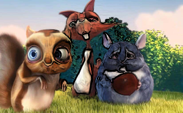

```dart
// Blur the image, fading from sharp on the left to blurred on the right.
final mask = img.Image(width: image.width, height: image.height);
for (final p in mask) {
  final v = 255 * p.x ~/ (image.width - 1);
  p.setRgb(v, v, v);
}
img.gaussianBlur(image, radius: 8, mask: mask);
```

### Amount

Filters with an `amount` parameter blend the result with the original: 0 leaves the image unchanged,
1 (the default for most filters) applies the full effect, and values in between give a partial
effect. With a mask, the mask value and `amount` are multiplied.

```dart
img.grayscale(image, amount: 0.5); // Half desaturated.
```

### Image formats and speed

Filters work on images of any [format](image_data.md#formats) and number of channels; most of them
work with normalized color values internally. Unless noted otherwise, filters change only the RGB
channels and leave alpha alone.

8-bit RGB and RGBA images (`Format.uint8`, the format of decoded JPEG and most PNG images) take fast
paths in several filters, including `adjustColor` (without `saturation` and `hue`), `gamma`,
`grayscale`, `convolution` (and `smooth` and `emboss`), `separableConvolution` and `gaussianBlur`,
`sobel` and `edgeGlow`, which can be many times faster than on other formats. The fast paths are
generally used only when no `mask` is given.

### Commands

Every filter except `histogramEqualization`, `histogramStretch` and `solarize` has a
[Command](commands.md) method with the same name and essentially the same parameters (masks are given
as `Command`s), so filters can run asynchronously or in an isolate. Any other function, including
those three, can be run with `Command.filter`:

```dart
final cmd = img.Command()
  ..decodeImageFile('photo.jpg')
  ..sepia(amount: 0.8)
  ..filter((image) => img.histogramStretch(image, stretchClipRatio: 0.01))
  ..writeToFile('photo_sepia.png');
await cmd.executeThread();
```

## Color adjustment

### [adjustColor](https://pub.dev/documentation/image/latest/image/adjustColor.html)

```dart
Image adjustColor(Image src, {Color? blacks, Color? whites, Color? mids,
    num? contrast, num? saturation, num? brightness, num? gamma, num? exposure,
    num? hue, num amount = 1, Image? mask, Channel maskChannel = Channel.luminance})
```


Applies several common color adjustments in one pass. Parameters left null are skipped. They are
applied in the order listed below.

| Parameter | Description |
| --- | --- |
| `blacks`, `whites`, `mids` | A levels adjustment, with the black, white and mid levels given as colors (so each channel can be adjusted separately). Pass all three together. |
| `brightness` | Multiplies the colors: 0 is black, 1 is unchanged, above 1 is brighter. |
| `saturation` | 0 is grayscale, 1 is unchanged, above 1 is more saturated. |
| `hue` | Rotates the hue, in degrees. |
| `contrast` | 0 is flat gray, 1 is unchanged, up to 2 for more contrast. |
| `gamma` | Raises the colors to this power: below 1 is brighter, above 1 is darker. |
| `exposure` | Multiplies the colors by `pow(2, exposure)`: 0 is unchanged, higher values are brighter. Must be 0 or more. |
| `amount` | See [Amount](#amount). |

```dart
img.adjustColor(image, saturation: 1.3, contrast: 1.1, brightness: 1.05);
img.adjustColor(image, hue: 30);
```

### [colorOffset](https://pub.dev/documentation/image/latest/image/colorOffset.html)

```dart
Image colorOffset(Image src, {num red = 0, num green = 0, num blue = 0, num alpha = 0,
    Image? mask, Channel maskChannel = Channel.luminance})
```

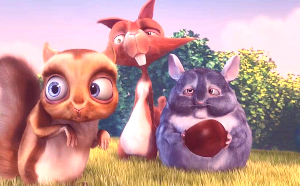

Adds an offset to each channel, including alpha. Offsets are given in 8-bit terms (-255 to 255) and
are scaled to the bit depth of the image.

```dart
img.colorOffset(image, red: 40, blue: -20); // Warmer.
```

### [contrast](https://pub.dev/documentation/image/latest/image/contrast.html)

```dart
enum ContrastMode { proportional, scurve }

Image contrast(Image src, {required num contrast, Image? mask,
    Channel maskChannel = Channel.luminance,
    ContrastMode mode = ContrastMode.proportional})
```

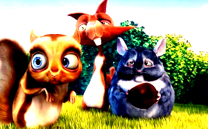

Adjusts the contrast of the image: 100 leaves it unchanged, lower values reduce contrast and higher
values increase it. `mode` selects the contrast curve. This filter currently works only with 8-bit
images; for other formats, use the `contrast` parameter of [adjustColor](#adjustcolor).

```dart
img.contrast(image, contrast: 150);
```

### [gamma](https://pub.dev/documentation/image/latest/image/gamma.html)

```dart
Image gamma(Image src, {required num gamma, Image? mask, Channel maskChannel = Channel.luminance})
```

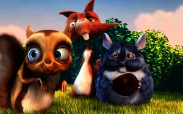

Raises each normalized color value to the power `gamma`: values above 1 darken the midtones, values
below 1 brighten them. `gamma: 2.2` converts sRGB-encoded colors to approximately linear, and
`gamma: 1 / 2.2` converts back.

```dart
img.gamma(image, gamma: 0.8);
```

### [grayscale](https://pub.dev/documentation/image/latest/image/grayscale.html)

```dart
Image grayscale(Image src, {num amount = 1, Image? mask, Channel maskChannel = Channel.luminance})
```

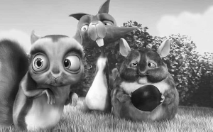

Sets the red, green and blue channels to the luminance of the pixel (`0.299 r + 0.587 g + 0.114 b`).
The image keeps its number of channels; to get a one-channel grayscale image, convert it afterwards
with `image.convert(numChannels: 1)`.

```dart
img.grayscale(image);
```

### [invert](https://pub.dev/documentation/image/latest/image/invert.html)

```dart
Image invert(Image src, {Image? mask, Channel maskChannel = Channel.luminance})
```

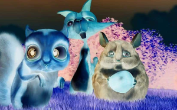

Inverts the red, green and blue channels (a negative image). Alpha is unchanged.

```dart
img.invert(image);
```

### [monochrome](https://pub.dev/documentation/image/latest/image/monochrome.html)

```dart
Image monochrome(Image src, {Color? color, num amount = 1,
    Image? mask, Channel maskChannel = Channel.luminance})
```

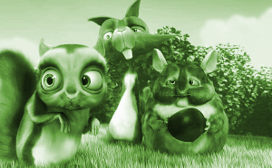

Tints a grayscale version of the image with `color`, using an overlay blend: dark pixels go toward
black, light pixels toward white, and midtones take the color. The default color is a muted green
(normalized RGB 0.45, 0.6, 0.3).

```dart
img.monochrome(image, color: img.ColorRgb8(90, 140, 220)); // Blue tint.
```

### [scaleRgba](https://pub.dev/documentation/image/latest/image/scaleRgba.html)

```dart
Image scaleRgba(Image src, {required Color scale, Image? mask,
    Channel maskChannel = Channel.luminance})
```

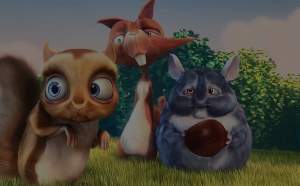

Multiplies each channel, including alpha, by the normalized value of the matching channel of `scale`.
For example, a scale of `ColorRgba8(255, 128, 128, 255)` keeps red and halves green and blue.

```dart
img.scaleRgba(image, scale: img.ColorRgba8(255, 128, 128, 255));
```

### [sepia](https://pub.dev/documentation/image/latest/image/sepia.html)

```dart
Image sepia(Image src, {num amount = 1, Image? mask, Channel maskChannel = Channel.luminance})
```

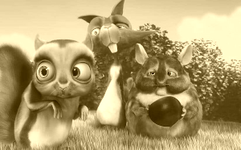

Applies a sepia (warm brown) tone.

```dart
img.sepia(image, amount: 0.7);
```

### [bleachBypass](https://pub.dev/documentation/image/latest/image/bleachBypass.html)

```dart
Image bleachBypass(Image src, {num amount = 1, Image? mask,
    Channel maskChannel = Channel.luminance})
```

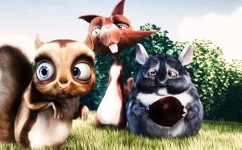

Simulates the bleach bypass film process: higher contrast and reduced saturation.

```dart
img.bleachBypass(image);
```

### [solarize](https://pub.dev/documentation/image/latest/image/solarize.html)

```dart
enum SolarizeMode { highlights, shadows }

Image solarize(Image src, {required int threshold,
    SolarizeMode mode = SolarizeMode.highlights})
```

| `SolarizeMode.highlights` | `SolarizeMode.shadows` |
| --- | --- |
| 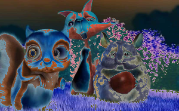 | 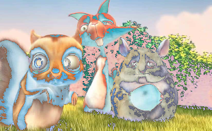 |

Inverts the colors of pixels brighter than `threshold` (in `highlights` mode) or darker than it (in
`shadows` mode), like the photographic solarization effect. The test uses the green channel.
`threshold` is in 8-bit terms (1 to 254) and is scaled to the bit depth of the image. Afterwards the
result is stretched to the full range of channel values to restore contrast. There's no mask
parameter.

```dart
img.solarize(image, threshold: 128, mode: img.SolarizeMode.shadows);
```

### [luminanceThreshold](https://pub.dev/documentation/image/latest/image/luminanceThreshold.html)

```dart
Image luminanceThreshold(Image src, {num threshold = 0.5, bool outputColor = false,
    num amount = 1, Image? mask, Channel maskChannel = Channel.luminance})
```

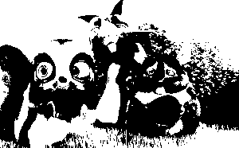

Makes pixels whose normalized luminance is below `threshold` (0 to 1) black. With `outputColor`
false, the other pixels become white, giving a black and white image; with `outputColor` true, they
keep their color.

```dart
img.luminanceThreshold(image, threshold: 0.4);
```

### [normalize](https://pub.dev/documentation/image/latest/image/normalize.html)

```dart
Image normalize(Image src, {required num min, required num max,
    Image? mask, Channel maskChannel = Channel.luminance})
```


Linearly maps the channel values of the image so that the smallest value becomes `min` and the
largest becomes `max`. `min` and `max` are raw channel values (0 to 255 for 8-bit images). The range
is found over all channels, and the mapping is applied to all channels, including alpha. Nothing
changes if the image has a single value.

```dart
img.normalize(image, min: 0, max: 255); // Stretch to the full 8-bit range.
```

### [histogramEqualization](https://pub.dev/documentation/image/latest/image/histogramEqualization.html)

```dart
enum HistogramEqualizeMode { grayscale, color }

Image histogramEqualization(Image src, {
    HistogramEqualizeMode mode = HistogramEqualizeMode.grayscale,
    num? outputRangeMin, num? outputRangeMax,
    Image? mask, Channel maskChannel = Channel.luminance})
```

Redistributes the brightness levels so that their histogram is roughly flat, which brings out detail
in low-contrast images.

| Parameter | Description |
| --- | --- |
| `mode` | `grayscale` equalizes the luminance and outputs a **grayscale** image. `color` equalizes the HSL lightness and keeps the hue and saturation. |
| `outputRangeMin`, `outputRangeMax` | The output range, in channel values. Defaults to 0 and the image's `maxChannelValue`. |

Fully transparent pixels are ignored. Float images are converted to uint8 first, and images with fewer
than 3 channels to RGB, so use the returned image. For more than 256 levels, convert to `Format.uint16`
before calling this function.

```dart
final equalized = img.histogramEqualization(image, mode: img.HistogramEqualizeMode.color);
```

### [histogramStretch](https://pub.dev/documentation/image/latest/image/histogramStretch.html)

```dart
Image histogramStretch(Image src, {
    HistogramEqualizeMode mode = HistogramEqualizeMode.grayscale,
    num? outputRangeMin, num? outputRangeMax, double stretchClipRatio = 0.015,
    Image? mask, Channel maskChannel = Channel.luminance})
```

Linearly stretches the brightness levels to fill the output range (an "auto levels" adjustment).
`stretchClipRatio` is the fraction of pixels ignored at each end of the histogram, so a few very dark
or bright pixels don't limit the stretch: the default 0.015 maps the 1.5th percentile to the minimum
output and the 98.5th to the maximum. The other parameters, and the conversions, are the same as for
[histogramEqualization](#histogramequalization).

```dart
final stretched = img.histogramStretch(image,
    mode: img.HistogramEqualizeMode.color, stretchClipRatio: 0.01);
```

## Channels

### [remapColors](https://pub.dev/documentation/image/latest/image/remapColors.html)

```dart
Image remapColors(Image src, {Channel red = Channel.red, Channel green = Channel.green,
    Channel blue = Channel.blue, Channel alpha = Channel.alpha})
```

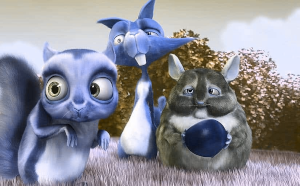

Rearranges the channels of the image: each output channel is set from the given source channel, which
can also be `Channel.luminance`.

```dart
img.remapColors(image, red: img.Channel.blue, blue: img.Channel.red); // Swap red and blue.
img.remapColors(image, alpha: img.Channel.luminance); // Alpha from brightness.
```

To reorder the channels of the raw data (for example to BGRA), see `Image.remapChannels` in
[Image Data](image_data.md#channels-and-channel-order).

### [copyImageChannels](https://pub.dev/documentation/image/latest/image/copyImageChannels.html)

```dart
Image copyImageChannels(Image src, {required Image from, bool scaled = false,
    Channel? red, Channel? green, Channel? blue, Channel? alpha,
    Image? mask, Channel maskChannel = Channel.luminance})
```

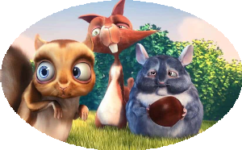

Copies channels from the `from` image into `src`. Each of `red`, `green`, `blue` and `alpha` names the
channel of `from` to copy into that channel of `src` (`Channel.luminance` included); channels left null
are unchanged. The values are copied as normalized values, so the two images can have different
formats. `from` should be the same size as `src`, unless `scaled` is true, in which case it is
stretched over `src` (with nearest-neighbor sampling).

```dart
// Use the luminance of a grayscale matte as the alpha channel.
final rgba = image.convert(numChannels: 4);
img.copyImageChannels(rgba, from: matte, scaled: true, alpha: img.Channel.luminance);
```

## Blur, sharpen and convolution

### [gaussianBlur](https://pub.dev/documentation/image/latest/image/gaussianBlur.html)

```dart
Image gaussianBlur(Image src, {required int radius, Image? mask,
    Channel maskChannel = Channel.luminance})
```


Blurs the image with a Gaussian kernel. `radius` is the number of pixels on each side of a pixel that
contribute to it (the standard deviation is two thirds of the radius); 0 does nothing. All channels,
including alpha, are blurred. It's a [separableConvolution](#separableconvolution), so the cost grows
linearly with the radius.

```dart
img.gaussianBlur(image, radius: 5);
```

### [smooth](https://pub.dev/documentation/image/latest/image/smooth.html)

```dart
Image smooth(Image src, {required num weight, Image? mask,
    Channel maskChannel = Channel.luminance})
```

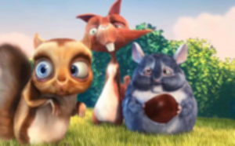

A light 3x3 blur: each pixel is replaced by a weighted average of itself (with `weight`) and its 8
neighbors (with weight 1). Larger weights keep more of the original pixel; `weight: 1` is a 3x3 box
blur.

```dart
img.smooth(image, weight: 2);
```

### [convolution](https://pub.dev/documentation/image/latest/image/convolution.html)

```dart
Image convolution(Image src, {required List<num> filter, num div = 1.0, num offset = 0.0,
    num amount = 1, Image? mask, Channel maskChannel = Channel.luminance})
```

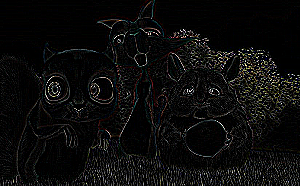

Applies a 3x3 convolution kernel to the RGB channels. `filter` is a list of 9 weights in row order
(top-left to bottom-right). Each output value is the weighted sum of the pixel and its neighbors,
divided by `div`, plus `offset`. Pixels past the edges repeat the edge pixels. The results are clamped
to 0 to 255, so this filter is intended for 8-bit images.

```dart
// Sharpen.
img.convolution(image, filter: [0, -1, 0, -1, 5, -1, 0, -1, 0]);

// Box blur: the weights sum to 9, so divide by 9.
img.convolution(image, filter: [1, 1, 1, 1, 1, 1, 1, 1, 1], div: 9);

// Edge detection (Laplacian), offset to mid gray.
img.convolution(image, filter: [0, 1, 0, 1, -4, 1, 0, 1, 0], offset: 128);
```

### [separableConvolution](https://pub.dev/documentation/image/latest/image/separableConvolution.html)

```dart
Image separableConvolution(Image src, {required SeparableKernel kernel,
    Image? mask, Channel maskChannel = Channel.luminance})
```


Applies a one-dimensional kernel horizontally and then vertically. This is much cheaper than a full
2D convolution of the same size, and is how [gaussianBlur](#gaussianblur) works. All channels,
including alpha, are filtered, and pixels past the edges are reflected.

A [SeparableKernel](https://pub.dev/documentation/image/latest/image/SeparableKernel-class.html) of a
given `size` has `2 * size + 1` coefficients; index `size` is the center pixel. Set coefficients with
`kernel[i] = value`, and use `scaleCoefficients` to normalize them. Kernels whose coefficients are all
positive and sum to 1 (blurs) are the intended use.

```dart
// A 7-pixel box blur.
final kernel = img.SeparableKernel(3);
for (var i = 0; i < kernel.length; ++i) {
  kernel[i] = 1;
}
kernel.scaleCoefficients(1 / kernel.length);
img.separableConvolution(image, kernel: kernel);
```

## Edges and stylize

### [sobel](https://pub.dev/documentation/image/latest/image/sobel.html)

```dart
Image sobel(Image src, {num amount = 1, Image? mask, Channel maskChannel = Channel.luminance})
```

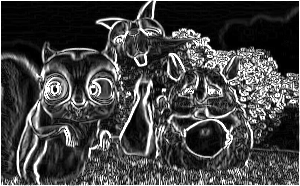

Sobel edge detection: replaces each pixel with the strength of the luminance gradient around it, so
edges are bright and flat areas black.

```dart
img.sobel(image);
```

### [edgeGlow](https://pub.dev/documentation/image/latest/image/edgeGlow.html)

```dart
Image edgeGlow(Image src, {num amount = 1, Image? mask, Channel maskChannel = Channel.luminance})
```

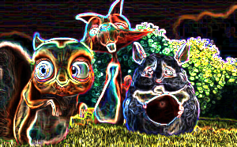

Keeps the colors of the edges and darkens everything else, so edges appear to glow.

```dart
img.edgeGlow(image);
```

### [sketch](https://pub.dev/documentation/image/latest/image/sketch.html)

```dart
Image sketch(Image src, {num amount = 1, Image? mask, Channel maskChannel = Channel.luminance})
```

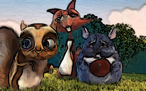

Darkens edges, giving a pencil sketch look while keeping the colors of flat areas.

```dart
img.sketch(image);
```

### [emboss](https://pub.dev/documentation/image/latest/image/emboss.html)

```dart
Image emboss(Image src, {num amount = 1, Image? mask, Channel maskChannel = Channel.luminance})
```

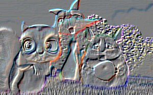

A [convolution](#convolution) that makes the image look raised or stamped: mostly gray, with edges
lit from the top left.

```dart
img.emboss(image);
```

### [billboard](https://pub.dev/documentation/image/latest/image/billboard.html)

```dart
Image billboard(Image src, {num grid = 10, num amount = 1, Image? mask,
    Channel maskChannel = Channel.luminance})
```

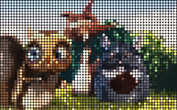

Renders the image as a grid of round "light bulbs", like a billboard display. `grid` sets the cell
size; larger values give larger cells.

```dart
img.billboard(image, grid: 15);
```

### [colorHalftone](https://pub.dev/documentation/image/latest/image/colorHalftone.html)

```dart
Image colorHalftone(Image src, {num amount = 1, int? centerX, int? centerY,
    num angle = 180, num size = 5, Image? mask, Channel maskChannel = Channel.luminance})
```

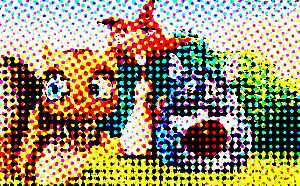

Simulates CMYK halftone printing, with a rotated dot screen for each ink. `size` is the dot size in
pixels, `angle` the screen angle in degrees, and `centerX`, `centerY` the origin of the pattern
(defaults to the image center).

```dart
img.colorHalftone(image, size: 3);
```

### [dotScreen](https://pub.dev/documentation/image/latest/image/dotScreen.html)

```dart
Image dotScreen(Image src, {num angle = 180, num size = 5.75, int? centerX, int? centerY,
    num amount = 1, Image? mask, Channel maskChannel = Channel.luminance})
```

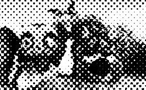

A black and white halftone dot screen, based on the luminance of the image. `angle` is the screen
angle in degrees, `size` scales the dot pattern, and `centerX`, `centerY` set its origin (defaults to
the image center).

```dart
img.dotScreen(image, angle: 45);
```

### [pixelate](https://pub.dev/documentation/image/latest/image/pixelate.html)

```dart
enum PixelateMode { upperLeft, average }

Image pixelate(Image src, {required int size, PixelateMode mode = PixelateMode.upperLeft,
    num amount = 1, Image? mask, Channel maskChannel = Channel.luminance})
```

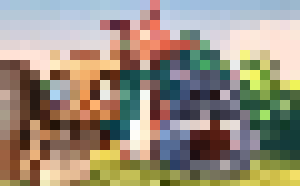

Divides the image into `size` x `size` blocks and fills each block with one color: the color of its
top-left pixel (`PixelateMode.upperLeft`, fast) or the average of the block (`PixelateMode.average`).
All channels, including alpha, are pixelated. A `size` of 1 or less does nothing.

```dart
img.pixelate(image, size: 12);
```

### [hexagonPixelate](https://pub.dev/documentation/image/latest/image/hexagonPixelate.html)

```dart
Image hexagonPixelate(Image src, {int? centerX, int? centerY, int size = 5,
    num amount = 1, Image? mask, Channel maskChannel = Channel.luminance})
```

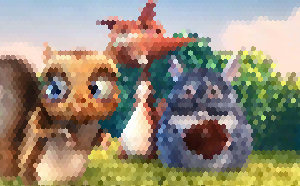

Pixelates the image with hexagonal cells. `size` is the cell size in pixels, and `centerX`, `centerY`
the origin of the grid.

```dart
img.hexagonPixelate(image, size: 10);
```

### [chromaticAberration](https://pub.dev/documentation/image/latest/image/chromaticAberration.html)

```dart
Image chromaticAberration(Image src, {int shift = 5, Image? mask,
    Channel maskChannel = Channel.luminance})
```

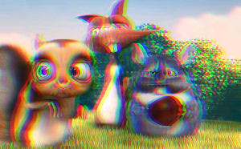

Simulates lens color fringing by shifting the red channel `shift` pixels to the left and the blue
channel `shift` pixels to the right.

```dart
img.chromaticAberration(image, shift: 3);
```

### [vignette](https://pub.dev/documentation/image/latest/image/vignette.html)

```dart
Image vignette(Image src, {num start = 0.3, num end = 0.85, num amount = 0.9,
    Color? color, Image? mask, Channel maskChannel = Channel.luminance})
```

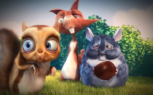

Fades the edges of the image toward `color` (default opaque black). `start` and `end` are distances
from the center, as fractions of the image height (the horizontal distance is scaled by the aspect
ratio): inside `start` the image is unchanged, beyond `end` it's fully `color`, with a smooth
transition between. Note that `amount` defaults to 0.9. Alpha is blended toward the alpha of `color`
too.

```dart
img.vignette(image, start: 0.5, end: 1.0, color: img.ColorRgb8(255, 255, 255));
```

### [dropShadow](https://pub.dev/documentation/image/latest/image/dropShadow.html)

```dart
Image dropShadow(Image src, int hShadow, int vShadow, int blur, {Color? shadowColor})
```

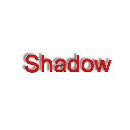

Returns a **new**, larger RGBA image with `src` drawn over a blurred shadow of its alpha shape.
`hShadow` and `vShadow` are the horizontal and vertical offsets of the shadow, in pixels, and `blur`
is the shadow's blur radius. The default `shadowColor` is black at 50% alpha. The source should have
an alpha channel for a shaped shadow; the canvas around the image is transparent.

```dart
final withShadow = img.dropShadow(logo, 5, 5, 10);
```

## Distortion

### [bulgeDistortion](https://pub.dev/documentation/image/latest/image/bulgeDistortion.html)

```dart
Image bulgeDistortion(Image src, {int? centerX, int? centerY, num? radius,
    num scale = 0.5, Interpolation interpolation = Interpolation.nearest,
    Image? mask, Channel maskChannel = Channel.luminance})
```

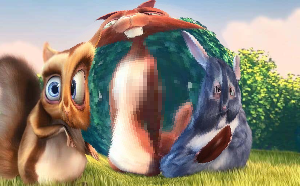

Distorts a circular area as if seen through a lens. `centerX`, `centerY` default to the image center
and `radius` to half the smaller image dimension. Positive `scale` values bulge (magnify) the center;
negative values pinch it. `interpolation` selects how the source is sampled: `Interpolation.linear` or
`cubic` give smoother results than the default `nearest`. All channels, including alpha, are
distorted.

```dart
img.bulgeDistortion(image, scale: 0.8, interpolation: img.Interpolation.linear);
```

### [stretchDistortion](https://pub.dev/documentation/image/latest/image/stretchDistortion.html)

```dart
Image stretchDistortion(Image src, {int? centerX, int? centerY,
    Interpolation interpolation = Interpolation.nearest,
    Image? mask, Channel maskChannel = Channel.luminance})
```

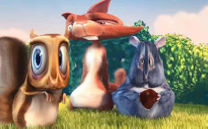

Stretches the area around `centerX`, `centerY` (default the image center) outward.

```dart
img.stretchDistortion(image, interpolation: img.Interpolation.linear);
```

## Noise

### [noise](https://pub.dev/documentation/image/latest/image/noise.html)

```dart
enum NoiseType { gaussian, uniform, saltAndPepper, poisson, rice }

Image noise(Image image, num sigma, {NoiseType type = NoiseType.gaussian,
    Random? random, Image? mask, Channel maskChannel = Channel.luminance})
```


Adds random noise to the RGB channels. `sigma` sets the strength, in channel values; a negative
`sigma` is a percentage of the image's value range instead.

| Type | Effect of `sigma` |
| --- | --- |
| `gaussian` | Adds normally distributed noise with standard deviation `sigma`. |
| `uniform` | Adds uniformly distributed noise between `-sigma` and `sigma`. |
| `saltAndPepper` | Sets about `sigma` percent of the pixels to the image's minimum or maximum value. |
| `poisson` | Replaces each value with a Poisson-distributed sample around it (shot noise). `sigma` isn't used. |
| `rice` | Rician noise with parameter `sigma`, as found in MRI images. |

Pass a seeded `Random` (from `dart:math`) for repeatable results.

```dart
img.noise(image, 20, random: Random(42));
img.noise(image, 5, type: img.NoiseType.saltAndPepper);
```

## HDR and tone mapping

See [High Dynamic Range Images](hdr.md) for loading and working with HDR images.

### [hdrToLdr](https://pub.dev/documentation/image/latest/image/hdrToLdr.html)

```dart
Image hdrToLdr(Image hdr, {num? exposure})
```

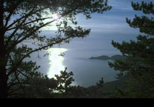

Returns a **new** 8-bit image from a high dynamic range (float) image, with the same number of
channels. Without `exposure`, color values are simply clamped to 0 to 1. With `exposure` (in stops),
the colors are scaled by the exposure and passed through a curve that compresses highlights and
applies gamma correction.

```dart
final ldr = img.hdrToLdr(hdrImage, exposure: 1);
```

### [reinhardTonemap](https://pub.dev/documentation/image/latest/image/reinhardTonemap.html)

```dart
Image reinhardTonemap(Image hdr, {Image? mask, Channel maskChannel = Channel.luminance})
```

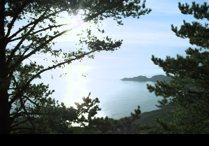

Applies Reinhard tone mapping in place, compressing the luminance range of an HDR image based on its
average luminance so bright areas don't blow out. Use it with float images. The result is still an HDR
image; convert it to 8-bit with [hdrToLdr](#hdrtoldr).

```dart
final ldr = img.hdrToLdr(img.reinhardTonemap(hdrImage));
```

## Normal maps

### [bumpToNormal](https://pub.dev/documentation/image/latest/image/bumpToNormal.html)

```dart
Image bumpToNormal(Image src, {num strength = 2})
```

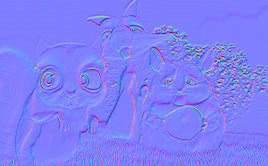

Returns a **new** image with a tangent-space normal map generated from a height (bump) map, for 3D
rendering. The red channel of `src` is the height (0 low, maximum high), and `strength` scales the
slopes.

```dart
final normalMap = img.bumpToNormal(heightMap, strength: 4);
```

## Color reduction and dithering

These functions reduce an image to a small palette and return a new palette image. They are covered
in detail, along with the quantizer classes, dither kernels and scan orders, in
[Color Quantization and Dithering](color_quantization.md).

### [quantize](https://pub.dev/documentation/image/latest/image/quantize.html)

```dart
Image quantize(Image src, {int numberOfColors = 256,
    QuantizeMethod method = QuantizeMethod.neuralNet,
    DitherKernel dither = DitherKernel.none,
    bool ditherSerpentine = false, DitherScanOrder? ditherScanOrder,
    double ditherStrength = 1.0})
```


```dart
final indexed = img.quantize(image, numberOfColors: 16, dither: img.DitherKernel.floydSteinberg);
```

### [ditherImage](https://pub.dev/documentation/image/latest/image/ditherImage.html)

```dart
Image ditherImage(Image image, {Quantizer? quantizer,
    DitherKernel kernel = DitherKernel.floydSteinberg, bool serpentine = false,
    DitherScanOrder scanOrder = DitherScanOrder.zigzag, double strength = 1.0})
```


```dart
final dithered = img.ditherImage(image,
    quantizer: img.OctreeQuantizer(image, numberOfColors: 8),
    kernel: img.DitherKernel.bayer8x8);
```

## Color helper functions

The library also exports helpers for color math, useful when writing your own filters:

| Function | Description |
| --- | --- |
| `getLuminance(Color c)`, `getLuminanceRgb(r, g, b)` | Luminance (`0.299 r + 0.587 g + 0.114 b`), in the same units as the input. |
| `getLuminanceNormalized(Color c)` | Luminance in the range 0 to 1. |
| `rgbToHsl(r, g, b)` | RGB (0 to 255) to `[h, s, l]`, each 0 to 1. |
| `hslToRgb(h, s, l, rgb)` | HSL (each 0 to 1) to RGB (0 to 255), written into the `List<int> rgb`. |
| `rgbToHsv(r, g, b, hsv)` | RGB to `[h, s, v]` with `h` in degrees, written into the `List<num> hsv`; `v` is in the units of the input. |
| `hsvToRgb(h, s, v, rgb)` | HSV (`h` in degrees, `s` and `v` 0 to 1) to RGB (0 to 1), written into the `List<num> rgb`. |
| `rgbToXyz`, `xyzToRgb`, `rgbToLab`, `labToRgb`, `xyzToLab`, `labToXyz` | Conversions between 8-bit sRGB, CIE XYZ and CIE L\*a\*b\*. |
| `cmykToRgb(c, m, y, k, rgb)` | CMYK (each 0 to 255) to RGB (0 to 255), written into the `List<int> rgb`. |
| `convertColor(c, {to, format, numChannels, alpha})` | Converts a `Color` to another format or number of channels. |
| `rgbaToUint32`, `uint32ToRed`, `uint32ToGreen`, `uint32ToBlue`, `uint32ToAlpha` | Pack and unpack 8-bit channels in a 32-bit integer (red in the low byte). |

```dart
final hsl = img.rgbToHsl(255, 128, 0); // [0.083..., 1.0, 0.5]
final rgb = [0, 0, 0];
img.hslToRgb(hsl[0], hsl[1], hsl[2], rgb); // [255, 128, 0]
```

## Writing your own filter

A filter is just a loop over the pixels. Iterating an image gives a
[Pixel](https://pub.dev/documentation/image/latest/image/Pixel-class.html) for each position, whose
channels can be read and written directly (see [Pixel Access](image_data.md#pixel-access)). Working
with normalized values makes the filter independent of the image format:

```dart
img.Image posterize(img.Image image, {int levels = 4}) {
  final n = levels - 1;
  for (final frame in image.frames) {
    for (final p in frame) {
      p
        ..rNormalized = (p.rNormalized * n).round() / n
        ..gNormalized = (p.gNormalized * n).round() / n
        ..bNormalized = (p.bNormalized * n).round() / n;
    }
  }
  return image;
}
```
