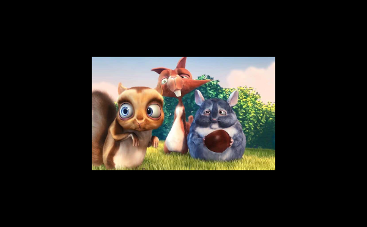
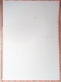

# Image Transformations

The Dart Image Library provides a number of functions for modifying images by applying a transformation
that changes the image, such as resizing and cropping. Most of these functions will return a new Image.

## Transform Functions

### [bakeOrientation](https://pub.dev/documentation/image/latest/image/bakeOrientation.html)

```dart
Image bakeOrientation(Image image)
```

If the image has orientation EXIF data, flip the image so its pixels are oriented and remove
the EXIF orientation. Returns a new Image.

### [copyCrop](https://pub.dev/documentation/image/latest/image/copyCrop.html)

```dart
Image copyCrop(Image src, { required int x, required int y, required int width, required int height,
    num radius = 0})
 ```

The radius argument is used to round the corners of the crop. Returns a new Image.


### [copyCropCircle](https://pub.dev/documentation/image/latest/image/copyCropCircle.html)

```dart
Image copyCropCircle(Image src, { int? radius, int? centerX, int? centerY })
```

Returns a new Image.


### [copyFlip](https://pub.dev/documentation/image/latest/image/copyFlip.html)

```dart
Image copyFlip(Image src, { required FlipDirection direction })
```

Returns a new Image.

### [copyExpandCanvas](https://pub.dev/documentation/image/latest/image/copyExpandCanvas.html)

```dart
Image copyExpandCanvas(Image src,
  {int? newWidth,
  int? newHeight,
  int? padding,
  ExpandCanvasPosition position = ExpandCanvasPosition.center,
  Color? backgroundColor,
  Image? toImage})
```

Returns a new image, where the original image has been placed on a new canvas of specified size at a specified location. The rest of the canvas is filled with the specified color or transparent if no color is provided. Throws an ArgumentError if both dimensions and padding are provided, or if the new dimensions or padding would result in a smaller canvas than the original image, or if the provided image does not match the new dimensions.

You can position the original image on the new canvas using the ExpandCanvasPosition enum, which includes the following options: topLeft, topCenter, topRight, centerLeft, center, centerRight, bottomLeft, bottomCenter, and bottomRight. By default, the image is positioned in the center.

You can also pass an existing image using the toImage parameter. This image will be modified and returned by the function. If you don't provide an image, a new one will be created with the specified dimensions.




### [copyRectify](https://pub.dev/documentation/image/latest/image/copyRectify.html)

```dart
Image copyRectify(Image src,
  { required Point topLeft,
  required Point topRight,
  required Point bottomLeft,
  required Point bottomRight,
  Interpolation interpolation = Interpolation.nearest,
  Image? toImage })
```

Returns a new Image.

 

### [copyResize](https://pub.dev/documentation/image/latest/image/copyResize.html)

```dart
Image copyResize(Image src, { int? width, int? height, bool? maintainAspect, Color? backgroundColor, Interpolation interpolation = Interpolation.nearest })
```
Returns a resized copy of the src image.
* If width is set but not height, height will be calculated to maintain the aspect ratio of src.
* If height is set but not width, width will be calculated to maintain the aspect ratio of src.
* If both width and height are set:
  * If maintainAspect is not set or is false, src will be stretched.
  * If maintainAspect is true, src will fill the new resolution without changing the aspect ratio, using backgroundColor
as the padding color.


### [copyResizeCropSquare](https://pub.dev/documentation/image/latest/image/copyResizeCropSquare.html)

```dart
Image copyResizeCropSquare(Image src, { required int size, num radius = 1, Interpolation interpolation = Interpolation.nearest })
```

The radius argument is used to round the corners of the crop. Returns a new Image.


### [copyRotate](https://pub.dev/documentation/image/latest/image/copyRotate.html)

```dart
Image copyRotate(Image src, { required num angle, Interpolation interpolation = Interpolation.nearest })
```

Returns a new Image.


### [flip](https://pub.dev/documentation/image/latest/image/flip.html)

```dart
Image flip(Image src, { required FlipDirection direction })
```

Flips the image in-place.


### [trim](https://pub.dev/documentation/image/latest/image/trim.html)

```dart
Image trim(Image src, { TrimMode mode = TrimMode.topLeftColor, Trim sides = Trim.all })
```

Returns a new Image.

 

### [findTrim](https://pub.dev/documentation/image/latest/image/findTrim.html)

```dart
List<int> findTrim(Image src, { TrimMode mode = TrimMode.transparent, Trim sides = Trim.all })
```
