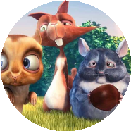
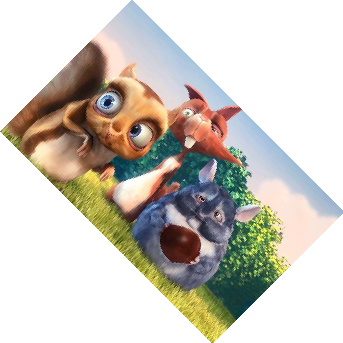
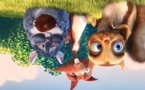
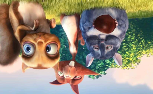
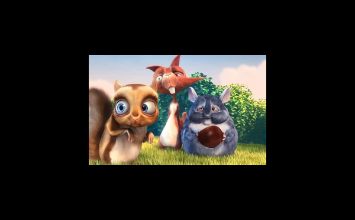
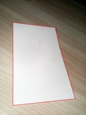
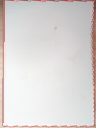

# Image Transformations

Transform functions change the geometry of an image: its size, orientation, or the region of it
you keep. This page covers resizing, cropping, rotating, flipping, expanding the canvas,
perspective correction, and trimming borders.

```dart
import 'package:image/image.dart' as img;

Future<void> main() async {
  final image = await img.decodeImageFile('photo.jpg');
  if (image == null) return;

  final thumbnail = img.copyResize(image, width: 200,
      interpolation: img.Interpolation.average);
  await img.encodePngFile('thumbnail.png', thumbnail);
}
```

## Copy or in place?

Functions whose names start with `copy` leave the source image untouched and return a new image.
The others modify the image you pass in.

| Function | Result |
|---|---|
| [copyResize](#copyresize), [copyResizeCropSquare](#copyresizecropsquare) | New image |
| [resize](#resize) | Modifies the image in place when it can, otherwise returns a new image. Always use the return value. |
| [copyCrop](#copycrop), [copyCropCircle](#copycropcircle) | New image |
| [copyRotate](#copyrotate) | New image |
| [copyFlip](#flip-and-copyflip) | New image |
| [flip, flipHorizontal, flipVertical, flipHorizontalVertical](#flip-and-copyflip) | Modifies the image in place and returns it |
| [copyExpandCanvas](#copyexpandcanvas) | New image, or the `toImage` you pass in |
| [copyRectify](#copyrectify) | New image, or the `toImage` you pass in |
| [trim](#trim-and-findtrim) | New image |
| [findTrim](#trim-and-findtrim) | Returns a rectangle; doesn't change the image |
| [bakeOrientation](#bakeorientation) | New image |

Transforms apply to every frame of an [animated image](animation.md), so resizing or cropping an
animated GIF gives you an animated result.

### Performance

When an image's pixels are whole bytes (all formats except the 1, 2 and 4 bit ones),
cropping, flipping, rotating by 90, 180 or 270 degrees, nearest-neighbor resizing, and
compositing with `BlendMode.direct` copy pixel bytes directly instead of reading and writing
each pixel as a color. Resizing 8-bit images with `linear`, `cubic` or `average` interpolation
also works on the bytes. These operations are the fastest way to transform an image.

To run transforms in a background isolate, use the [Command API](commands.md), which has
methods for most of these functions.

## Resizing

### [copyResize](https://pub.dev/documentation/image/latest/image/copyResize.html)

```dart
Image copyResize(Image src, {int? width, int? height, bool? maintainAspect,
    Color? backgroundColor, Interpolation interpolation = Interpolation.nearest})
```

Returns a resized copy of `src`.

* Give only `width` or only `height` and the other dimension is calculated to keep the aspect
  ratio of `src`.
* Give both and the image is stretched to exactly that size, unless `maintainAspect` is `true`.
  Then the image is scaled to fit inside `width` x `height` without distortion and centered, and
  the leftover area is filled with `backgroundColor`. Without a `backgroundColor` that area is
  left at zero: transparent if the image has an alpha channel, black otherwise.
* Giving neither throws an `ImageException`. A `width` or `height` of 0 or less is treated as
  not given.
* If the image has an EXIF orientation, it's applied while resizing, and the result has no
  orientation tag. `width` and `height` refer to the image as it's displayed (after the
  orientation is applied).
* Palette images are always resized with `Interpolation.nearest`.

```dart
// Scale to 320 pixels wide, keeping the aspect ratio.
final small = img.copyResize(image, width: 320);

// Fit inside a 256x256 square, padded with white.
final boxed = img.copyResize(image,
    width: 256,
    height: 256,
    maintainAspect: true,
    backgroundColor: img.ColorRgb8(255, 255, 255));

// High quality downscale for a thumbnail.
final thumb = img.copyResize(image,
    width: 128, interpolation: img.Interpolation.average);
```


### [resize](https://pub.dev/documentation/image/latest/image/resize.html)

```dart
Image resize(Image src, {int? width, int? height, bool? maintainAspect,
    Color? backgroundColor, Interpolation interpolation = Interpolation.nearest})
```

Takes the same arguments as `copyResize` and produces the same result, but reuses the memory of
`src` when it can, which avoids allocating a second image. Use it when you don't need the
original any more.

```dart
image = img.resize(image, width: 800, interpolation: img.Interpolation.linear);
```

Always use the returned image. `resize` works in place, returning `src`, when the image is
shrinking. It returns a new image (as `copyResize` would) in these cases:

* The image is enlarged in either dimension. The exception is `Interpolation.nearest` on an
  8-bit image with 1, 3 or 4 channels, when the total pixel count doesn't grow (for example
  200x100 to 100x200).
* `Interpolation.cubic`, unless it's downscaling an 8-bit image without letterboxing.
* `maintainAspect` letterboxing that leaves padding around the image. The exception is
  `Interpolation.nearest` on an 8-bit image with no `backgroundColor`.
* The image has an EXIF orientation. It's applied first, which creates a copy.

If the size doesn't change, `src` is returned unchanged.

After an in-place resize the image keeps its original buffer, so the raw bytes from
`image.getBytes()` or `image.toUint8List()` can be longer than the new width x height requires.

### [copyResizeCropSquare](https://pub.dev/documentation/image/latest/image/copyResizeCropSquare.html)

```dart
Image copyResizeCropSquare(Image src, {required int size,
    Interpolation interpolation = Interpolation.nearest, num radius = 0,
    bool antialias = false})
```

Returns a `size` x `size` square copy: the image is scaled so its shorter side is `size`, and
the center of the longer side is cropped. This is the usual way to make square avatars and
thumbnails. A `size` of 0 or less throws an `ImageException`.

`radius` rounds the corners, leaving them transparent, and `antialias` smooths the rounded
edges. To get transparent corners, the image needs an alpha channel (see the
[tip below](#transparent-corners)).

```dart
final avatar = img.copyResizeCropSquare(image,
    size: 96, radius: 16, antialias: true,
    interpolation: img.Interpolation.average);
```


### Interpolation

The `interpolation` argument of the resize, rotate and rectify functions chooses how output
pixels are computed from the source pixels.

| Value | How it works | Use it for |
|---|---|---|
| `Interpolation.nearest` (default) | Copies the closest source pixel. | Speed, pixel art, palette images, and exact copies. Fastest; blocky when enlarging and aliased when shrinking. |
| `Interpolation.linear` | Blends the 2x2 nearest pixels (bilinear). | Smooth enlarging and moderate shrinking. |
| `Interpolation.cubic` | Blends the 4x4 nearest pixels (bicubic). | The sharpest enlargements. The slowest option. |
| `Interpolation.average` | In `copyResize` and `resize`, averages every source pixel covered by an output pixel (a box filter). Elsewhere it's the same as `linear`. | Shrinking by large factors, such as thumbnails. `linear` and `cubic` only sample a few pixels, so large reductions alias. |

Images with a palette can't be blended, so they always use `nearest`. Convert them first
(`image.convert(numChannels: 4)`) if you want smooth results.

## Cropping

### [copyCrop](https://pub.dev/documentation/image/latest/image/copyCrop.html)

```dart
Image copyCrop(Image src, {required int x, required int y, required int width,
    required int height, num radius = 0, bool antialias = true})
```

Returns the `width` x `height` region of `src` whose top-left corner is at (`x`, `y`). The
rectangle is clipped to the image, so the result can be smaller than you asked for.

`radius` rounds the corners of the crop, leaving them transparent; `antialias` (on by default)
smooths those rounded edges.

```dart
final face = img.copyCrop(image, x: 120, y: 40, width: 200, height: 200);
final card = img.copyCrop(image.convert(numChannels: 4),
    x: 0, y: 0, width: 300, height: 200, radius: 20);
```


### [copyCropCircle](https://pub.dev/documentation/image/latest/image/copyCropCircle.html)

```dart
Image copyCropCircle(Image src, {int? radius, int? centerX, int? centerY,
    bool antialias = true})
```

Returns a square image, `2 * radius` pixels wide, containing the circle of `src` with the given
center and radius. Pixels outside the circle are transparent.

* `centerX` and `centerY` default to the center of the image.
* `radius` defaults to half the shorter side, so the largest circle that fits.
* `antialias` (on by default) smooths the edge of the circle.
* If `src` has a `backgroundColor`, the result is cleared to it first.

```dart
final circle = img.copyCropCircle(image.convert(numChannels: 4));
```



#### Transparent corners

Rounded crops, circle crops, rotations and expanded canvases make pixels transparent by setting
their alpha. An image without an alpha channel (such as a decoded JPEG, which has 3 channels)
can't store that, so those pixels come out black. Convert to 4 channels first, and save to a
format that keeps alpha, such as PNG or WebP:

```dart
final rgba = image.numChannels == 4 ? image : image.convert(numChannels: 4);
final circle = img.copyCropCircle(rgba);
await img.encodePngFile('circle.png', circle);
```

### [trim and findTrim](https://pub.dev/documentation/image/latest/image/trim.html)

```dart
Image trim(Image src, {TrimMode mode = TrimMode.topLeftColor,
    Trim sides = Trim.all, num fuzzy = 0, int padding = 0})

List<int> findTrim(Image src, {TrimMode mode = TrimMode.transparent,
    Trim sides = Trim.all, num fuzzy = 0, int padding = 0})
```

`trim` crops away a uniform border, returning a new image. `findTrim` only finds the rectangle,
returned as `[x, y, width, height]`, which you can pass to `copyCrop`. If the whole image is
border, the rectangle is the whole image. Note that the default `mode` differs between the two
functions.

| `mode` | What counts as border |
|---|---|
| `TrimMode.transparent` | Fully transparent pixels. An image without an alpha channel is returned unchanged by `trim`. |
| `TrimMode.topLeftColor` | Pixels the same color as the top-left pixel. |
| `TrimMode.bottomRightColor` | Pixels the same color as the bottom-right pixel. |

* `sides` chooses which edges to trim: `Trim.top`, `Trim.bottom`, `Trim.left`, `Trim.right`, or
  `Trim.all`. Combine them with `|`.
* `fuzzy` (0 to 1) also treats colors within that distance of the border color as border, which
  helps with JPEG compression noise. It's ignored for `TrimMode.transparent`.
* `padding` keeps that many pixels of border around the content, within the image bounds.
* For animations, the rectangle is found from the first frame and applied to every frame.

```dart
// Remove a white border, tolerating compression noise, but keep 4 pixels of margin.
final trimmed = img.trim(image, fuzzy: 0.05, padding: 4);

// Only trim transparent rows from the top and bottom.
final rect = img.findTrim(image,
    mode: img.TrimMode.transparent, sides: img.Trim.top | img.Trim.bottom);
final cropped = img.copyCrop(image,
    x: rect[0], y: rect[1], width: rect[2], height: rect[3]);
```

 

## Rotating and flipping

### [copyRotate](https://pub.dev/documentation/image/latest/image/copyRotate.html)

```dart
Image copyRotate(Image src, {required num angle,
    Interpolation interpolation = Interpolation.nearest})
```

Returns a copy of `src` rotated clockwise by `angle` degrees. Negative angles rotate
counter-clockwise.

* Multiples of 90 degrees are exact and fast: the pixels are moved without any resampling, and
  90 or 270 swaps the width and height. `interpolation` is ignored. An angle of 0 returns a copy.
* Any other angle samples the source with `interpolation` (use `linear` or `cubic` for smooth
  edges). The result is enlarged to fit the whole rotated image. The uncovered corners are
  filled with the image's `backgroundColor` if it has one, and are otherwise left at zero
  (transparent, or black without an alpha channel; see
  [transparent corners](#transparent-corners)).

```dart
final upright = img.copyRotate(image, angle: 90);
final tilted = img.copyRotate(image.convert(numChannels: 4),
    angle: 45, interpolation: img.Interpolation.linear);
```



### [flip and copyFlip](https://pub.dev/documentation/image/latest/image/flip.html)

```dart
Image flip(Image src, {required FlipDirection direction})
Image flipHorizontal(Image src)
Image flipVertical(Image src)
Image flipHorizontalVertical(Image src)

Image copyFlip(Image src, {required FlipDirection direction})
```

`flip` and the `flipHorizontal`, `flipVertical` and `flipHorizontalVertical` shortcuts mirror
the image in place and return the same image. `copyFlip` returns a flipped copy and leaves
`src` unchanged.

| `FlipDirection` | Effect |
|---|---|
| `horizontal` | Mirror left to right. |
| `vertical` | Mirror top to bottom. |
| `both` | Both, which is the same as rotating 180 degrees. |

```dart
img.flipHorizontal(image); // image is now mirrored
final upsideDown = img.copyFlip(image, direction: img.FlipDirection.vertical);
```




### [bakeOrientation](https://pub.dev/documentation/image/latest/image/bakeOrientation.html)

```dart
Image bakeOrientation(Image image)
```

Cameras often save photos sideways and record the intended orientation in an EXIF tag.
`bakeOrientation` returns a copy whose pixels are rotated and flipped to match that tag, with
the tag removed and all other EXIF data kept. If there's no orientation, it returns an
unmodified copy. Use it before saving to formats that don't store EXIF data, or before
processing that needs the pixels the right way up.

The JPEG decoder already applies the orientation while decoding, and `copyResize` and `resize`
apply it automatically. The other transforms ignore the tag. See [EXIF Data](exif.md).

```dart
final upright = img.bakeOrientation(image);
```

## Canvas and perspective

### [copyExpandCanvas](https://pub.dev/documentation/image/latest/image/copyExpandCanvas.html)

```dart
Image copyExpandCanvas(Image src, {int? newWidth, int? newHeight, int? padding,
    ExpandCanvasPosition position = ExpandCanvasPosition.center,
    Color? backgroundColor, Image? toImage})
```

Places `src` on a larger canvas and returns it. Give either both `newWidth` and `newHeight`, or
a `padding` to add on every side. The rest of the canvas is filled with `backgroundColor`, or
left transparent (black without an alpha channel) if there's none. Partly transparent pixels of
`src` are blended over the background. EXIF data is copied from `src`.

`position` sets where `src` goes on the canvas: `topLeft`, `topCenter`, `topRight`,
`centerLeft`, `center` (default), `centerRight`, `bottomLeft`, `bottomCenter` or `bottomRight`.

Pass an existing image as `toImage` to draw into it instead of allocating a new one. It must be
exactly the new size, and it's modified and returned.

`copyExpandCanvas` throws an `ArgumentError` if:

* neither the new size nor `padding` is given, or both are,
* the new size is smaller than `src`, or
* `toImage` isn't the new size.

```dart
// Add a 20 pixel black border.
final framed = img.copyExpandCanvas(image,
    padding: 20, backgroundColor: img.ColorRgb8(0, 0, 0));

// Put the image at the top of a 1080x1920 canvas.
final story = img.copyExpandCanvas(image,
    newWidth: 1080,
    newHeight: 1920,
    position: img.ExpandCanvasPosition.topCenter,
    backgroundColor: img.ColorRgb8(255, 255, 255));
```

The new size must be at least as large as `src`. To fit a larger image onto a fixed canvas,
resize it first, or use `copyResize` with `maintainAspect: true`.



### [copyRectify](https://pub.dev/documentation/image/latest/image/copyRectify.html)

```dart
Image copyRectify(Image src, {required Point topLeft, required Point topRight,
    required Point bottomLeft, required Point bottomRight,
    Interpolation interpolation = Interpolation.nearest, Image? toImage})
```

Maps the four-sided region of `src` with the given corners to a whole rectangular image. This
straightens a photo of a document, screen or sign taken at an angle. The corners are pixel
coordinates in `src`.

The result is the same size as `src`, unless you pass `toImage`, in which case the region is
drawn to fill `toImage`, which is returned. Use `toImage` to choose the output size.

```dart
final page = img.copyRectify(photo,
    topLeft: img.Point(110, 64),
    topRight: img.Point(520, 92),
    bottomLeft: img.Point(86, 640),
    bottomRight: img.Point(548, 610),
    interpolation: img.Interpolation.linear,
    toImage: img.Image(width: 420, height: 594));
```

 

## See also

* [Drawing](draw.md): `compositeImage` for pasting one image onto another, with scaling.
* [Image Data](image_data.md): formats, channels, and `Image.convert`.
* [Commands](commands.md): run transforms asynchronously or in an isolate.
* [API reference](https://pub.dev/documentation/image/latest/image/)
